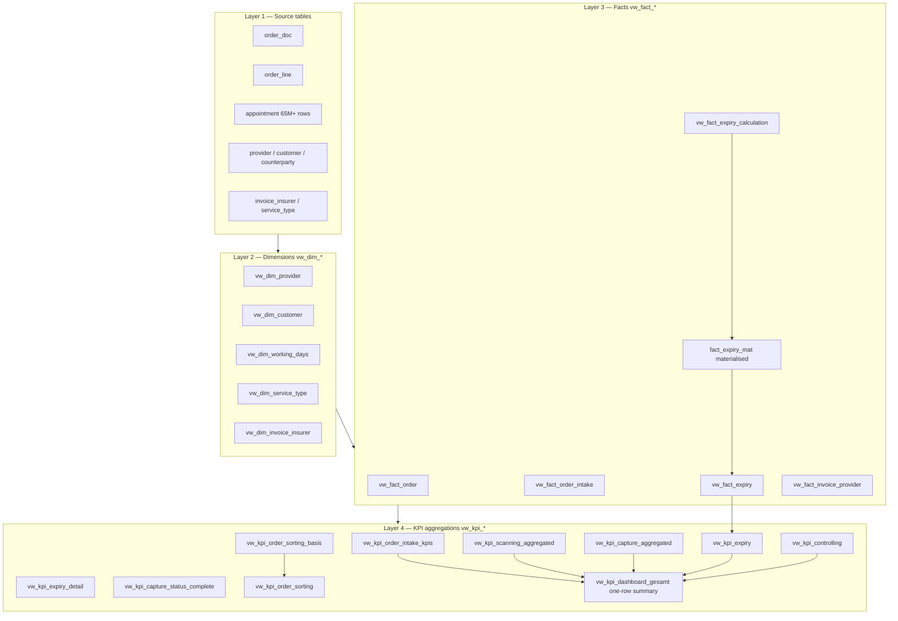

# PostgreSQL AI-Assisted Development

[](https://github.com/fidpa/psql-ai-assisted-development/actions/workflows/lint.yml)
[](LICENSE)
[](https://github.com/fidpa/psql-ai-assisted-development/releases)


[](https://www.claude.com/product/claude-code)
[](#project-status)
[](https://github.com/fidpa/psql-ai-assisted-development/commits/main)

A reference implementation for AI-assisted PostgreSQL development: star-schema KPI views, incremental materialised views, working-day arithmetic with movable holidays, a 64 GB tuning config, and a Claude Code workflow blueprint — extracted from a real production migration from SQL Server Express to PostgreSQL 16, fully documented in Diátaxis style.

**The Problem**: Most "AI-assisted development" content shows a chat transcript. This repository shows what a database codebase actually looks like *after* an AI assistant has been a real collaborator for months — not the prompts, but the artefacts. It is not a tutorial on how to prompt. It is a working snapshot of patterns, conventions, and guardrails that emerged from real iteration with Claude Code on a production migration from a 1 GB-RAM-bound SQL Server Express instance to PostgreSQL 16 on a 64 GB host.

The source domain has been replaced with a generic document-processing / order-tracking schema, and identifiers, comments, and KPI codes were re-generated. The patterns — incremental materialised views, working-day arithmetic with movable holidays, multi-stage retention tracking with a configurable window (default 180 days), star-schema KPI aggregation — are preserved as-is and apply equally well to insurance-claim handling, legal-document review, logistics returns, or any other multi-stage back-office workflow.

## Features

- **Star-schema views**: `vw_dim_*`, `vw_fact_*`, `vw_kpi_*` with consistent
  prefixing and a documented dependency graph.
- **Incremental materialised view**: pattern for refreshing expiry calculations
  over 65 M+ rows without locking out readers.
- **Working-day arithmetic**: PostgreSQL functions for business-day math
  including movable holidays (Easter, Whitsun) — easily adaptable to other regions.
- **Multi-stage workflow KPIs**: intake → classification → digitisation →
  registration → retention — each stage expressed as its own KPI family.
- **PostgreSQL tuning config**: [`postgresql.conf` overrides](config/postgres-tuning-64gb.conf)
  tuned for a 64 GB NVMe host, with a [deployment guide](docs/reference/POSTGRES_TUNING.md)
  and verification queries.
- **Operational scripts**: [`pg_dumpall`-based backup with retention](scripts/backup-postgres.sh),
  and a [cache-hit-ratio / `pg_stat_statements` performance monitor](scripts/monitor-postgres-performance.sh).
- **Diátaxis documentation**: tutorial / how-to / reference / explanation —
  four entry points for four kinds of reader.
- **Claude Code workflow blueprint**: a [`CLAUDE.md`](CLAUDE.md) that doubles
  as a system prompt and a navigation map.
- **CI guardrails**: anonymisation sweep (base64-obfuscated forbidden list),
  `sqlfluff`, `shellcheck`, `markdownlint` — every PR is checked before merge.

---

## Architecture



Read [`docs/explanation/PROJEKT_ARCHITEKTUR.md`](docs/explanation/PROJEKT_ARCHITEKTUR.md)
for the full architecture rationale.

---

## Proof of substance — a KPI view

The point of the showcase is not the names, it is what the code looks like.
The following is an abridged extract from [`sql/views/03_kpi/vw_kpi_dashboard.sql`](sql/views/03_kpi/vw_kpi_dashboard.sql)
— the real file is ~80 lines and keeps the original German column names from
the migration as a deliberate artefact:

```sql
-- vw_kpi_dashboard_gesamt — combines all KPI families into a single
-- dashboard row. Reads from five upstream KPI views, materialises one
-- row per call.
CREATE OR REPLACE VIEW vw_kpi_dashboard_gesamt AS
WITH e_werte AS (
    SELECT e1_vorheriger_tag AS e1, e2_letzte_3_tage AS e2
    FROM vw_kpi_order_intake_kpis
    WHERE e1_vorheriger_tag IS NOT NULL
    ORDER BY datum DESC
    LIMIT 1
),
s_werte AS (SELECT * FROM vw_kpi_scanning_aggregated),
d_werte AS (SELECT * FROM vw_kpi_capture_aggregated),
v_werte AS (SELECT * FROM vw_kpi_expiry),
c_werte AS (
    SELECT c1_nettosumme_unbestaetigte_kr AS c1,
           c2_count_unbestaetigte_kr      AS c2
    FROM vw_kpi_controlling
)
SELECT
    CURRENT_DATE AS datum,
    -- [...] weekday name + DD.MM.YYYY formatting omitted for brevity
    COALESCE(e.e1, 0) AS e1_last_working_day,        -- intake
    COALESCE(s.s1_naechste_3_tage, 0) AS s1_naechste_3_tage,  -- scanning
    COALESCE(d.d0_heute, 0) AS d0_heute,             -- capture today
    COALESCE(v.expiringe_vo_gesamt, 0) AS expiringe_vo_gesamt,  -- retention
    COALESCE(c.c1, 0) AS c1_nettosumme_unbestaetigte_kr  -- controlling
    -- [...] further columns omitted
FROM (SELECT 1 AS dummy) base
LEFT JOIN e_werte e ON TRUE
LEFT JOIN s_werte s ON TRUE
LEFT JOIN d_werte d ON TRUE
LEFT JOIN v_werte v ON TRUE
LEFT JOIN c_werte c ON TRUE;
```

Patterns visible at a glance:
- **One CTE per KPI family** — the alphabetic codes (`E`/`S`/`D`/`V`/`C`)
  isolate each business question, so a change in scanning logic cannot leak
  into expiry KPIs.
- **`ORDER BY ... LIMIT 1`** is the chosen pattern for "give me the latest
  value" inside a one-row dashboard view, instead of `MAX()` over the full
  history (cheaper plan on materialised upstreams).
- **`LEFT JOIN ON TRUE` against a one-row base** — produces exactly one row
  even when some CTE returns zero rows, so the dashboard never goes blank.
- **`COALESCE`-wrapping** every value at the outer layer means Power BI
  visuals see numeric zeros instead of nulls.
- **No analytics in the view** — the view *composes*, the upstreams aggregate.
  This keeps DirectQuery plans flat and readable.

---

## Quick Start

```bash
git clone https://github.com/fidpa/psql-ai-assisted-development.git
cd psql-ai-assisted-development

# Start a throwaway PostgreSQL
docker run --rm -d --name showcase-pg \
    -e POSTGRES_PASSWORD=showcase \
    -p 5432:5432 postgres:16

# Apply schema + standalone helper functions (always works out-of-the-box)
export PGPASSWORD=showcase
psql -h localhost -U postgres -f sql/schemas/01_schema.sql
psql -h localhost -U postgres -f sql/functions/fn_easter_sunday.sql

# Sanity check
psql -h localhost -U postgres -c "SELECT fn_easter_sunday(2026);"
#  fn_easter_sunday
# ------------------
#  2026-04-05
```

> **Note**: The repository ships **views and helper functions only** — the
> source tables (`order_doc`, `order_line`, `appointment`, `provider`,
> `customer`, `counterparty`, `invoice_insurer`, `service_type`, etc.) are
> intentionally **not** included, because the *point* of the showcase is the
> view layer and the conventions, not a runnable demo with synthetic data.
> Wire the views to your own schema, or use the file headers as a migration
> guide.

For production deployment, see [`docs/reference/POSTGRES_TUNING.md`](docs/reference/POSTGRES_TUNING.md)
— `shared_buffers`, `effective_cache_size`, `pg_hba.conf` templates, and
verification queries for a 64 GB NVMe host.

---

## Repository Tour

| Path | Read this if you want to … |
|------|----------------------------|
| [`README.md`](README.md) | … understand the project at a glance |
| [`CLAUDE.md`](CLAUDE.md) | … see the workflow manifest that drives day-to-day work |
| [`docs/tutorial/`](docs/tutorial/) | … walk through the migration from scratch |
| [`docs/how-to/`](docs/how-to/) | … solve a specific operational task (daily ops, troubleshooting) |
| [`docs/reference/`](docs/reference/) | … look up syntax, parameters, KPI definitions, tuning |
| [`docs/explanation/`](docs/explanation/) | … understand *why* decisions were made |
| [`docs/entry-points/`](docs/entry-points/) | … give Claude Code a thematic starting point |
| [`sql/views/01_dim/`](sql/views/01_dim/) | … see the dimension views (star schema base) |
| [`sql/views/02_fact/`](sql/views/02_fact/) | … see fact views built on dimensions |
| [`sql/views/03_kpi/`](sql/views/03_kpi/) | … see KPI aggregations on top of facts |
| [`sql/functions/`](sql/functions/) | … reuse working-day / holiday helpers |
| [`sql/tables/`](sql/tables/) | … see the materialised expiry table pattern |
| [`config/`](config/) | … grab a tuned `postgresql.conf` for a 64 GB host |
| [`scripts/`](scripts/) | … deploy, validate, back up, monitor |

---

## What you can learn from this repo

1. **Star-schema KPI design**: how to layer `vw_dim_* → vw_fact_* → vw_kpi_*`
   so that BI consumers (Power BI in this case) get flat, fast views without
   any analytical logic leaking down into the source tables.
2. **Incremental materialised views over very large event tables**:
   the [`fact_expiry_mat`](sql/tables/fact_expiry_mat.sql) table plus its
   index strategy is the pattern that handles a 65 M+ row event table with
   second-level dashboard latency. The matching refresh procedure
   (`sp_aktualisiere_expiry_mat`) was part of the source project but is
   intentionally not shipped here — wire your own scheduled `REFRESH
   MATERIALIZED VIEW CONCURRENTLY` or trigger-based incremental refresh
   against the table definition.
3. **Working-day & movable-holiday arithmetic in pure SQL**:
   [`fn_easter_sunday`](sql/functions/fn_easter_sunday.sql) and
   [`fn_working_days_between`](sql/functions/fn_working_days_between.sql) — no
   application-side calendar required.
4. **SQL Server → PostgreSQL migration mechanics**:
   `GETDATE() → CURRENT_DATE`, `DATEADD → INTERVAL`, `RIGHT('0…' + CAST) → LPAD`,
   `+ as concat → ||`, et cetera — documented per-file in the view headers.
5. **AI-assistant workflow as code**: the [`CLAUDE.md`](CLAUDE.md) file
   shows how a project-level system prompt can navigate, constrain, and
   document an AI agent's day-to-day work.
6. **Production-grade `postgresql.conf`**: a real 64 GB tuning baseline with
   the *why* documented next to every override.
7. **Anonymisation as a CI guardrail**: the workflow file
   ([`.github/workflows/lint.yml`](.github/workflows/lint.yml)) carries a
   base64-encoded forbidden-term list that runs on every PR — so the
   anonymised state cannot regress over time.

---

## The Claude Code workflow

Open [`CLAUDE.md`](CLAUDE.md) first. It is the single source of truth for
how an AI assistant should navigate this codebase: which files to consult
first, which conventions to follow, which traps to avoid. It is intentionally
kept in German to demonstrate a German-first AI workflow — the README and
SQL are English, but a domain-specific assistant brief can live in its
working language.

---

## Project status

| Phase | State |
|-------|-------|
| Skeleton & branding | ✅ Complete |
| SQL & docs migration (anonymised) | ✅ Complete |
| PostgreSQL tuning integration | ✅ Complete |
| Second-round conceptual generalisation | ✅ Complete |
| README & docs finalisation | ✅ Complete |
| Validation sweep + first release | ✅ Released as v0.1.3 (2026-05-14) |

---

## Requirements

- PostgreSQL 16 or newer
- `psql` client
- Bash 5+ (for operational scripts)
- Optional: `sqlfluff`, `shellcheck`, `markdownlint-cli` for local linting
- Optional: [Claude Code](https://www.claude.com/product/claude-code) for the
  full workflow experience

---

## License

[MIT](LICENSE) © 2026 Marc Allgeier ([@fidpa](https://github.com/fidpa))

---

## See Also

Other showcase repositories in the same series:

- [`bash-production-toolkit`](https://github.com/fidpa/bash-production-toolkit) — production-grade Bash patterns
- [`linux-monitoring-templates`](https://github.com/fidpa/linux-monitoring-templates) — monitoring building blocks
- [`ubuntu-server-security`](https://github.com/fidpa/ubuntu-server-security) — host hardening
- [`bash-markdown-link-validator`](https://github.com/fidpa/bash-markdown-link-validator) — used internally to keep this repo's docs honest

---

*Anonymised from a real production migration. The patterns are real; the
domain has been generalised.*
