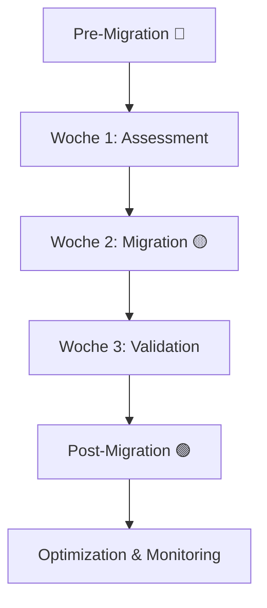

# Entry Point: PostgreSQL Migration

> **Navigation**: [Entry Points](README.md) → PostgreSQL Migration
> **Zweck**: 3-Wochen-Migration von SQL Server Express zu PostgreSQL

## 🎯 Wann nutzen?

- [ ] Migration planen (Pre-Migration 🔵)
- [ ] Schema konvertieren (Migration 🟡)
- [ ] Daily Sync konfigurieren
- [ ] Migration validieren
- [ ] Post-Migration Optimierung (🟢)

## ⚡ Quick Start

**Phase prüfen → Timeline folgen → Technisch umsetzen**

1. **Aktuelle Phase**: [TASK_STATUS.md](../reference/TASK_STATUS.md) - 🔵🟡🟢 Status
2. **Timeline**: [POSTGRESQL_MIGRATION_GUIDE.md](../tutorial/POSTGRESQL_MIGRATION_GUIDE.md) - 3-Wochen-Plan
3. **Technisch**: [POSTGRESQL_MIGRATION_TECHNISCH.md](../tutorial/POSTGRESQL_MIGRATION_TECHNISCH.md) - Schema-Conversion

---

## 📍 Hauptpfad: Migration durchführen



---

## 🔵 Pre-Migration Phase (Woche 1)

**Checkliste**: [TASK_STATUS.md](../reference/TASK_STATUS.md) → 🔵 Pre-Migration Tasks

### Schritt 1: SQL Server inventarisieren
- **Dokument**: [MIGRATION_ASSESSMENT.md](../how-to/MIGRATION_ASSESSMENT.md)
- **Aktionen**:
  - Datenvolumen ermitteln (SQL Server Limits prüfen)
  - Schema analysieren (Tabellen, Views, Constraints)
  - Dependencies dokumentieren (View-Hierarchie)

**SQL Server Inventarisierung**:
```powershell
# Remote vom Mac via SSH
ssh windows-pc "powershell.exe -Command '
Get-Service -Name \"SQL*\" | Select-Object Name, Status, StartType

# Datenbank-Liste
sqlcmd -S localhost -E -Q \"SELECT name, database_id, create_date FROM sys.databases\"
'"
```

### Schritt 2: Risiken verstehen
- **Dokument**: [MIGRATION_STRATEGIE.md](../explanation/MIGRATION_STRATEGIE.md)
- **Wichtige Punkte**:
  - **Warum PostgreSQL**: Performance (64GB RAM vs 1GB), Kosten (Open Source), Features (Materialized Views)
  - **Risiken**: Datenverlust (Niedrig), Performance-Degradation (Mittel), Power BI Inkompatibilität (Niedrig)
  - **Mitigations**: Tägliche Backups, Parallel-Betrieb, DirectQuery-Tests

### Schritt 3: Tools vorbereiten
- **Dokument**: [MAC_POSTGRESQL_VERBINDUNG.md](../how-to/MAC_POSTGRESQL_VERBINDUNG.md)
- **Setup**:
  1. SSH-Tunnel konfigurieren (Mac → Windows)
  2. PostgreSQL installieren (Version 17)
  3. psql CLI testen
  4. Power BI DirectQuery testen

---

## 🟡 Migration Phase (Woche 2)

**Checkliste**: [TASK_STATUS.md](../reference/TASK_STATUS.md) → 🟡 Migration Tasks

### Schritt 1: Schema konvertieren
- **Dokument**: [POSTGRESQL_MIGRATION_TECHNISCH.md](../tutorial/POSTGRESQL_MIGRATION_TECHNISCH.md)
- **Datentyp-Mapping**:

| SQL Server | PostgreSQL | Beispiel |
|------------|------------|----------|
| `NVARCHAR(n)` | `TEXT` | UTF-8 nativ |
| `DATETIME` | `TIMESTAMP` | Zeitstempel |
| `INT` | `INTEGER` | Ganzzahl |
| `DECIMAL(p,s)` | `NUMERIC(p,s)` | Dezimal |
| `MONEY` | `NUMERIC(19,4)` | Währung |
| `BIT` | `BOOLEAN` | Boolean |
| `UNIQUEIDENTIFIER` | `UUID` | UUID |

**Automatisierte Schema-Migration**:
```bash
powershell.exe "$env:PGPASSWORD='${PGPASSWORD}'; & 'C:\\Program Files\\PostgreSQL\\17\\bin\\psql.exe' -h localhost -p 5432 -U postgres -d postgres -c \"
CREATE SCHEMA IF NOT EXISTS order_processing;
SET search_path TO order_processing, public;

CREATE TABLE IF NOT EXISTS order_doc (
    order_id BIGINT PRIMARY KEY,
    order_number VARCHAR(50) NOT NULL,
    erstellt_am TIMESTAMP DEFAULT CURRENT_TIMESTAMP,
    expiry_date DATE,
    net_amount NUMERIC(10,2),
    is_aktiv BOOLEAN DEFAULT true
);
\""
```

### Schritt 2: Views migrieren (Bottom-Up)
- **Dokument**: [POSTGRESQL_MIGRATION_TECHNISCH.md](../tutorial/POSTGRESQL_MIGRATION_TECHNISCH.md)
- **View-Hierarchie**:

```
Level 1: Dimensions (vw_dim_*)
  ↓
Level 2: Facts (vw_fact_*)
  ↓
Level 3: KPIs (vw_kpi_*)
  ↓
Level 4: Power BI Interface (vw_powerbi_*)
```

**Wichtig**: IMMER Bottom-Up migrieren (Dependencies beachten)!

**Level 1 Beispiel**:
```sql
CREATE OR REPLACE VIEW vw_dim_customer AS
SELECT customer_id, customer_code, segment_id, created_at
FROM customer;
```

**Level 2 Beispiel**:
```sql
CREATE OR REPLACE VIEW vw_fact_order AS
SELECT r.*, p.customer_code as customer_label
FROM order_doc r
JOIN vw_dim_customer p ON r.customer_id = p.customer_id;
```

### Schritt 3: Daily Sync konfigurieren
- **Dokument**: [POSTGRESQL_AUTOMATION.md](../how-to/POSTGRESQL_AUTOMATION.md)
- **Strategie**: SQL Server bleibt Source of Truth, täglich um 2:00 MEZ Sync

**Master Sync Script**:
```bash
#!/bin/bash
# daily_sync_master.sh

SCRIPT_DIR="/opt/postgresql_sync"
LOG_DIR="/var/log/postgresql_sync"
LOG_FILE="$LOG_DIR/sync_$(date +%Y%m%d_%H%M%S).log"

main() {
    log "=== Starting daily sync from SQL Server to PostgreSQL ==="

    # Step 1: Export from SQL Server
    "$SCRIPT_DIR/01_export_sqlserver.sh"

    # Step 2: Transform data
    "$SCRIPT_DIR/02_transform_data.sh"

    # Step 3: Import to PostgreSQL
    "$SCRIPT_DIR/03_import_postgresql.sh"

    # Step 4: Update materialized views
    "$SCRIPT_DIR/04_refresh_materialized.sh"

    # Step 5: Validate sync
    "$SCRIPT_DIR/05_validate_sync.sh"

    log "=== Sync completed successfully ==="
}
```

---

## 🟢 Post-Migration Phase (Woche 3)

**Checkliste**: [TASK_STATUS.md](../reference/TASK_STATUS.md) → 🟢 Post-Migration Tasks

### Schritt 1: Validieren
- **Dokument**: [POSTGRESQL_MIGRATION_TECHNISCH.md](../tutorial/POSTGRESQL_MIGRATION_TECHNISCH.md) → Validation
- **Data Validation**:

```sql
-- Row Count Validation
SELECT 'order_doc' as tabelle,
       (SELECT COUNT(*) FROM sqlserver.order_doc) as sqlserver_count,
       (SELECT COUNT(*) FROM postgresql.order_doc) as postgresql_count;

-- Data Quality Checks
SELECT * FROM validate_migration();
```

### Schritt 2: Optimieren
- **Dokument**: [POSTGRESQL_REFERENZ.md](../reference/POSTGRESQL_REFERENZ.md) → Performance
- **Optimierungen**:
  1. **Materialized Views**: Für 65M+ Rows (Appointment-Tabelle)
  2. **Partitioning**: Für zeitbasierte Queries
  3. **Indexes**: Auf Join-Spalten und Filter-Spalten

**Materialized View Beispiel**:
```sql
CREATE MATERIALIZED VIEW vw_fact_expiry_mat AS
SELECT
    appointment_id,
    order_id,
    expiry_date,
    COUNT(*) OVER (PARTITION BY order_id) as appointment_count
FROM appointment
WHERE expiry_date >= CURRENT_DATE - INTERVAL '180 days';

-- Index für Performance
CREATE INDEX idx_expiry_date ON vw_fact_expiry_mat(expiry_date);
CREATE INDEX idx_order_id ON vw_fact_expiry_mat(order_id);

-- Regelmäßig refreshen (täglich)
REFRESH MATERIALIZED VIEW CONCURRENTLY vw_fact_expiry_mat;
```

### Schritt 3: Tägliche Operations einrichten
- **Dokument**: [POSTGRESQL_DAILY_OPS.md](../how-to/POSTGRESQL_DAILY_OPS.md)
- **Health Checks**:

```bash
# Daily Health Check
powershell.exe "$env:PGPASSWORD='${PGPASSWORD}'; & 'C:\\Program Files\\PostgreSQL\\17\\bin\\psql.exe' -h localhost -p 5432 -U postgres -d postgres -c \"
SELECT * FROM daily_health_check();
\""
```

**Monitoring**:
- Connection Limits überwachen
- Query Performance tracken
- Backup-Status prüfen
- Disk Space monitoren

---

## 🔀 Spezialfälle

### Connection Limits erreicht
**Symptom**: `FATAL: sorry, too many clients already`

**Emergency Response**: [POSTGRESQL_AUTOMATION.md](../how-to/POSTGRESQL_AUTOMATION.md)

```sql
SELECT emergency_response('CONNECTION_LIMIT');
```

**Langfristige Lösung**:
```sql
-- postgresql.conf
max_connections = 200  -- erhöhen von default 100
```

---

### View-Dependency-Fehler
**Symptom**: `ERROR: view "vw_kpi_..." depends on view "vw_fact_..."`

**Lösung**: [POSTGRESQL_MIGRATION_TECHNISCH.md](../tutorial/POSTGRESQL_MIGRATION_TECHNISCH.md) → Level-basierte Migration

**Regel**: Immer Bottom-Up (Dimensions → Facts → KPIs → PowerBI)

**Dependency Tree prüfen**:
```sql
SELECT
    dependent_view.relname as view_name,
    source_table.relname as depends_on
FROM pg_depend
JOIN pg_rewrite ON pg_depend.objid = pg_rewrite.oid
JOIN pg_class as dependent_view ON pg_rewrite.ev_class = dependent_view.oid
JOIN pg_class as source_table ON pg_depend.refobjid = source_table.oid
WHERE dependent_view.relname LIKE 'vw_%'
ORDER BY dependent_view.relname;
```

---

### Power BI DirectQuery bricht ab
**Symptom**: Power BI Dashboard lädt nicht mehr, Timeout-Fehler

**Diagnose**: [POWER_BI_DASHBOARD_ENTWICKLUNG.md](../how-to/POWER_BI_DASHBOARD_ENTWICKLUNG.md)

**Häufige Ursachen**:
1. **Max 1M Rows pro Visual** überschritten
2. **Query > 5 Sekunden** (DirectQuery Limit)
3. **Aggregation in Power BI** statt in SQL

**Lösung**:
```sql
-- ❌ FALSCH: Rohdaten
CREATE VIEW vw_powerbi_raw AS
SELECT * FROM appointment; -- 65M+ Rows!

-- ✅ RICHTIG: Pre-Aggregation
CREATE VIEW vw_powerbi_dashboard_live AS
SELECT
    DATE(erstellt_am) as datum,
    COUNT(*) as count_orders,
    SUM(net_amount) as gesamtwert
FROM vw_fact_order
GROUP BY DATE(erstellt_am);
```

**Siehe auch**: [Power BI & Analytics Entry Point](POWER_BI_ANALYTICS.md)

---

## 📚 Alle relevanten Dokumente

### Tutorial (Lernen)
- [POSTGRESQL_MIGRATION_GUIDE.md](../tutorial/POSTGRESQL_MIGRATION_GUIDE.md) - 3-Wochen Timeline ⭐
- [POSTGRESQL_MIGRATION_TECHNISCH.md](../tutorial/POSTGRESQL_MIGRATION_TECHNISCH.md) - Schema-Conversion ⭐
- [SSH_SETUP_MAC_WINDOWS.md](../tutorial/SSH_SETUP_MAC_WINDOWS.md) - SSH-Setup für Remote-Zugriff

### How-To (Aufgaben)
- [MIGRATION_ASSESSMENT.md](../how-to/MIGRATION_ASSESSMENT.md) - SQL Server Inventory
- [POSTGRESQL_AUTOMATION.md](../how-to/POSTGRESQL_AUTOMATION.md) - Daily Sync & Emergency ⭐
- [POSTGRESQL_DAILY_OPS.md](../how-to/POSTGRESQL_DAILY_OPS.md) - Post-Migration Ops
- [MAC_POSTGRESQL_VERBINDUNG.md](../how-to/MAC_POSTGRESQL_VERBINDUNG.md) - Mac Connection Setup

### Reference (Nachschlagen)
- [TASK_STATUS.md](../reference/TASK_STATUS.md) - Phase Checklisten ⭐
- [POSTGRESQL_REFERENZ.md](../reference/POSTGRESQL_REFERENZ.md) - Technische Details
- [SQL_SERVER_LEGACY.md](../reference/SQL_SERVER_LEGACY.md) - Express Limits, Bugs

### Explanation (Verstehen)
- [MIGRATION_STRATEGIE.md](../explanation/MIGRATION_STRATEGIE.md) - Warum PostgreSQL ⭐
- [PROJEKT_ARCHITEKTUR.md](../explanation/PROJEKT_ARCHITEKTUR.md) - System-Design

---

## 🔗 Verwandte Entry Points

- **[SQL & Database Development](SQL_DATABASE_DEVELOPMENT.md)** - Für View-Entwicklung nach Migration
- **[Remote Connectivity](REMOTE_MANAGEMENT_CONNECTIVITY.md)** - Für SSH/VPN Setup
- **[Session Management](SESSION_DOCUMENTATION_MANAGEMENT.md)** - Für Task-Tracking während Migration

---

**⭐ = Kritisch für Migration**

## 💡 Migration Timeline

```
Woche 1 (🔵 Pre-Migration):
├── Tag 1-2: SQL Server Inventory
├── Tag 3-4: Risiken & Tools
└── Tag 5: Schema-Analyse

Woche 2 (🟡 Migration):
├── Tag 6-8: Schema konvertieren
├── Tag 9-10: Views migrieren (Bottom-Up)
└── Tag 11-12: Daily Sync konfigurieren

Woche 3 (🟢 Post-Migration):
├── Tag 13-14: Validierung
├── Tag 15-16: Optimierung (Materialized Views)
└── Tag 17-18: Monitoring & Documentation
```
