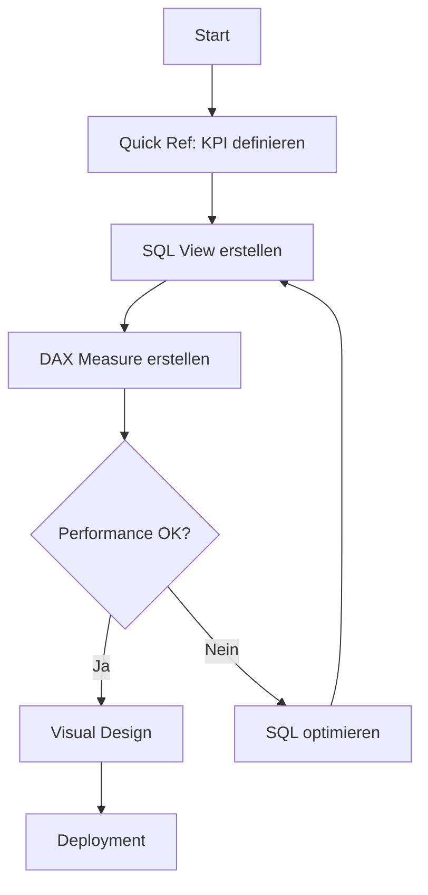

# Entry Point: Power BI & KPI Analytics

> **Navigation**: [Entry Points](README.md) → Power BI & Analytics
> **Zweck**: Power BI Dashboards entwickeln, DirectQuery optimieren, DAX-Measures erstellen

## 🎯 Wann nutzen?

- [ ] Power BI Dashboard entwickeln/optimieren
- [ ] DAX Measures erstellen
- [ ] DirectQuery Performance-Probleme lösen
- [ ] KPI-Definitionen nachschlagen
- [ ] Business Rules validieren

## ⚡ Quick Start

**KPI nachschlagen → DAX kopieren → SQL optimieren**

1. **KPI-Definitionen**: [QUICK_REF.md](../imports/QUICK_REF.md)
2. **DAX Measures**: [POWER_BI_DAX_KATALOG.md](../reference/POWER_BI_DAX_KATALOG.md)
3. **DirectQuery**: [POWER_BI_DASHBOARD_ENTWICKLUNG.md](../how-to/POWER_BI_DASHBOARD_ENTWICKLUNG.md)

---

## 📍 Hauptpfad: Neues Dashboard erstellen



### Schritt 1: KPI verstehen
- **Dokument**: [QUICK_REF.md](../imports/QUICK_REF.md)
- **Aktion**: Kategorie prüfen (kpi_a, kpi_b, S1, D1, V1, C1)
- **Business Rules**: CLAUDE.md → Zentrale Geschäftsregeln

**KPI-Kategorien**:
- **E (Eingang)**: kpi_a = OrderIntake letzter Arbeitstag, kpi_b = OrderIntake aktueller Monat
- **S (Scanning)**: S1 = Gescanse Orders heute, S2 = Scan-Backlog
- **D (Digitalisierung)**: D1 = Erfasste Orders heute, D2 = CaptureStatus
- **V (Expiry)**: V1 = Expiring Orders nächste 30 Tage
- **C (Controlling)**: C1 = Offener NetAmount, C2 = Durchschnittliche Bearbeitungszeit

### Schritt 2: SQL View entwickeln
- **Dokument**: [PROJEKT_ARCHITEKTUR.md](../explanation/PROJEKT_ARCHITEKTUR.md)
- **Pfad**: [SQL Entry Point](SQL_DATABASE_DEVELOPMENT.md) → View-Entwicklung
- **Kritisch**: Aggregation in SQL, NICHT in Power BI!

**View-Hierarchie verstehen**:
```
vw_dim_* (Dimensions)
  ↓
vw_fact_* (Facts)
  ↓
vw_kpi_* (KPI-Calculationen)
  ↓
vw_powerbi_* (Power BI Interface) ← Hier ansetzen!
```

**Beispiel Power BI View**:
```sql
CREATE OR REPLACE VIEW vw_powerbi_dashboard_live AS
SELECT
    DATE(erstellt_am) as datum,
    provider_group,
    COUNT(*) as count_orders,
    SUM(net_amount) as gesamtwert,
    AVG(bearbeitungszeit_tage) as avg_bearbeitungszeit
FROM vw_fact_order
GROUP BY DATE(erstellt_am), provider_group;
```

### Schritt 3: DAX Measure erstellen
- **Dokument**: [POWER_BI_DAX_KATALOG.md](../reference/POWER_BI_DAX_KATALOG.md)
- **Aktion**: Existierende Measures kopieren & anpassen

**Beispiel DAX Measure**:
```dax
// kpi_a: OrderIntake letzter Arbeitstag
kpi_a_last_working_day =
CALCULATE(
    SUM(vw_powerbi_dashboard_live[count_orders]),
    vw_powerbi_dashboard_live[datum] = [LastWorkingDay]
)

// LastWorkingDay (Helper Measure)
LastWorkingDay =
CALCULATE(
    MAX(vw_dim_working_days[datum]),
    vw_dim_working_days[is_arbeitstag] = TRUE,
    vw_dim_working_days[datum] <= TODAY()
)
```

### Schritt 4: DirectQuery testen
- **Dokument**: [POWER_BI_DASHBOARD_ENTWICKLUNG.md](../how-to/POWER_BI_DASHBOARD_ENTWICKLUNG.md)
- **Limits beachten**:
  - Max 1M Rows pro Visual
  - < 5 Sekunden Ladezeit
  - Keine Post-Aggregation in DAX (nur in SQL!)

**Performance-Test**:
```sql
-- Query-Dauer messen
EXPLAIN ANALYZE
SELECT * FROM vw_powerbi_dashboard_live
WHERE datum >= CURRENT_DATE - INTERVAL '30 days';
```

### Schritt 5: Visual Design & Deployment
- **Dokument**: [POWER_BI_DASHBOARD_ENTWICKLUNG.md](../how-to/POWER_BI_DASHBOARD_ENTWICKLUNG.md)
- **Deployment-Checkliste**:
  - [ ] Farbschema konsistent (siehe DAX-Katalog)
  - [ ] Accessibility geprüft (Kontrast, Schriftgröße)
  - [ ] Mobile-View getestet
  - [ ] DirectQuery Performance < 5s
  - [ ] Dokumentation aktualisiert

---

## 🔀 Spezialfälle

### DirectQuery langsam (> 5 Sekunden)
**Symptom**: Dashboard lädt langsam, Power BI zeigt Timeout-Warnung

**Diagnose**: [TROUBLESHOOTING_DATENBANK.md](../how-to/TROUBLESHOOTING_DATENBANK.md)

**Häufige Ursachen**:
1. **Zu viele Rows**: Visual lädt > 1M Rows
2. **Aggregation in DAX**: Statt in SQL pre-aggregieren
3. **Fehlende Indizes**: Join-Spalten nicht indiziert
4. **Materialized Views fehlen**: Appointment-Tabelle (65M+ Rows) nicht materialisiert

**Lösung**:
```sql
-- ❌ FALSCH: Rohdaten an Power BI
CREATE VIEW vw_powerbi_raw AS
SELECT * FROM appointment; -- 65M+ Rows!

-- ✅ RICHTIG: Pre-Aggregation in SQL
CREATE MATERIALIZED VIEW vw_powerbi_dashboard_live AS
SELECT
    DATE(erstellt_am) as datum,
    provider_group,
    COUNT(*) as count_orders,
    SUM(net_amount) as gesamtwert
FROM vw_fact_order
GROUP BY DATE(erstellt_am), provider_group;

-- Index erstellen
CREATE INDEX idx_dashboard_date ON vw_powerbi_dashboard_live(datum);

-- Täglich refreshen
REFRESH MATERIALIZED VIEW CONCURRENTLY vw_powerbi_dashboard_live;
```

---

### Sentinel-Provider filtern
**Business Rule**: ProviderGroupID IN (1, 2)

**Dokument**: [PROJEKT_ARCHITEKTUR.md](../explanation/PROJEKT_ARCHITEKTUR.md) → vw_Dim_Provider

**DAX-Filter**:
```dax
// Sentinel-Provider filtern
SentinelOrders =
CALCULATE(
    SUM(vw_powerbi_dashboard_live[count_orders]),
    vw_dim_provider[ProviderGroupID] IN {1, 2}
)

// Non-Sentinel-Provider
StandardOrders =
CALCULATE(
    SUM(vw_powerbi_dashboard_live[count_orders]),
    NOT(vw_dim_provider[ProviderGroupID] IN {1, 2})
)
```

**SQL-Implementierung** (besser für Performance):
```sql
CREATE VIEW vw_kpi_provideranalyse AS
SELECT
    CASE
        WHEN b.provider_group_id IN (1, 2) THEN 'Sentinel'
        ELSE 'Standard'
    END as provider_typ,
    COUNT(r.order_id) as count_orders,
    SUM(r.net_amount) as gesamtwert
FROM vw_fact_order r
JOIN vw_dim_provider b ON r.provider_id = b.provider_id
GROUP BY provider_typ;
```

---

### Auto-Processing Ausschlüsse
**Business Rules** (siehe CLAUDE.md):
- ServiceType IN (10, 20, 30, 40) → Kein Auto-Processing
- Hat SourceSystem → Kein Auto-Processing
- Bereits elektronisch (ImportType 6/7) → Kein Auto-Processing

**Implementierung**: [PROJEKT_ARCHITEKTUR.md](../explanation/PROJEKT_ARCHITEKTUR.md)

**SQL-Logik**:
```sql
CREATE VIEW vw_kpi_auto_processing_kandidaten AS
SELECT
    r.order_id,
    r.order_number,
    CASE
        WHEN r.service_type_id IN (10, 20, 30, 40) THEN 'ServiceType ausgeschlossen'
        WHEN b.has_source_system = TRUE THEN 'SourceSystem vorhanden'
        WHEN r.import_type IN (1, 2) THEN 'Bereits elektronisch'
        ELSE 'Auto-Processing möglich'
    END as auto_processing_status
FROM vw_fact_order r
JOIN vw_dim_provider b ON r.provider_id = b.provider_id;
```

**Power BI Visual**:
- Pie Chart: Auto-Processing Status Distribution
- Table: Kandidaten-Liste mit Status

---

### Expiration (180-day retention window)
**Business Rule**: 180 days after the reference event (configurable)

**Logik**: [QUICK_REF.md](../imports/QUICK_REF.md) → V1 Definition

**SQL View**: `vw_fact_expiry_mat` (materialisiert wegen 65M+ Appointment-Rows)

**DAX Measure**:
```dax
// V1: Expiring Orders nächste 30 Tage
V1_ExpiringOrders =
CALCULATE(
    COUNTROWS(vw_fact_expiry_mat),
    vw_fact_expiry_mat[expiry_date] >= TODAY(),
    vw_fact_expiry_mat[expiry_date] <= TODAY() + 30
)
```

**Wichtig**: Diese View MUSS materialisiert sein (Performance)!

```sql
CREATE MATERIALIZED VIEW vw_fact_expiry_mat AS
SELECT
    order_id,
    MAX(service_date) + INTERVAL '180 days' as expiry_date
FROM appointment
GROUP BY order_id;

-- Täglich refreshen
REFRESH MATERIALIZED VIEW CONCURRENTLY vw_fact_expiry_mat;
```

---

## 📚 Alle relevanten Dokumente

### Tutorial (Lernen)
- Keine Power BI Tutorials (nutze How-To)

### How-To (Aufgaben)
- [POWER_BI_DASHBOARD_ENTWICKLUNG.md](../how-to/POWER_BI_DASHBOARD_ENTWICKLUNG.md) - Deployment ⭐
- [TROUBLESHOOTING_DATENBANK.md](../how-to/TROUBLESHOOTING_DATENBANK.md) - DirectQuery Performance
- [POSTGRESQL_DAILY_OPS.md](../how-to/POSTGRESQL_DAILY_OPS.md) - SQL-Operationen

### Reference (Nachschlagen)
- [QUICK_REF.md](../imports/QUICK_REF.md) - KPI-Definitionen ⭐
- [POWER_BI_DAX_KATALOG.md](../reference/POWER_BI_DAX_KATALOG.md) - DAX Measures ⭐
- [POSTGRESQL_REFERENZ.md](../reference/POSTGRESQL_REFERENZ.md) - View-Hierarchie

### Explanation (Verstehen)
- [PROJEKT_ARCHITEKTUR.md](../explanation/PROJEKT_ARCHITEKTUR.md) - Business Logic ⭐
- CLAUDE.md - Zentrale Geschäftsregeln (embedded)

---

## 🔗 Verwandte Entry Points

- **[SQL & Database Development](SQL_DATABASE_DEVELOPMENT.md)** - Für View-Entwicklung
- **[PostgreSQL Migration](POSTGRESQL_MIGRATION.md)** - Für DirectQuery nach Migration
- **[Session Management](SESSION_DOCUMENTATION_MANAGEMENT.md)** - Für TodoWrite während Entwicklung

---

**⭐ = Kritisch für Power BI Entwicklung**

## 💡 DirectQuery Best Practices

### 1. Aggregation in SQL, nicht in DAX
```sql
-- ✅ RICHTIG: Pre-Aggregation
CREATE VIEW vw_powerbi_aggregiert AS
SELECT datum, COUNT(*), SUM(betrag)
FROM fakten
GROUP BY datum;

-- Power BI DAX (einfach):
Measure = SUM([betrag])
```

### 2. Materialized Views für große Tabellen
```sql
-- Appointment-Tabelle: 65M+ Rows
CREATE MATERIALIZED VIEW vw_fact_expiry_mat AS
SELECT /* aggregierte Daten */
FROM appointment;
```

### 3. Max 1M Rows pro Visual
```sql
-- Filter in SQL, nicht in Power BI!
CREATE VIEW vw_powerbi_filtered AS
SELECT *
FROM vw_fact_order
WHERE erstellt_am >= CURRENT_DATE - INTERVAL '12 months';
```

### 4. Performance-Ziel: < 5 Sekunden
```sql
-- Query-Dauer messen
EXPLAIN ANALYZE SELECT * FROM vw_powerbi_dashboard_live;
```
