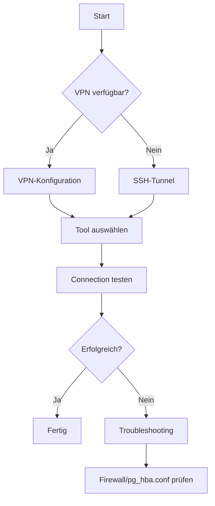

# Entry Point: Remote Management & Connectivity

> **Navigation**: [Entry Points](README.md) → Remote Management & Connectivity
> **Zweck**: Mac ↔ Windows SQL Server/PostgreSQL Verbindung, SSH-Tunnel, VPN-Setup

## 🎯 Wann nutzen?

- [ ] Mac zu Windows SQL Server verbinden
- [ ] SSH-Tunnel konfigurieren
- [ ] VPN-Setup durchführen
- [ ] PostgreSQL remote connecten
- [ ] Connection-Probleme troubleshooten

## ⚡ Quick Start

**Tool auswählen → Verbindung konfigurieren → Testen**

1. **Mac → PostgreSQL**: [MAC_POSTGRESQL_VERBINDUNG.md](../how-to/MAC_POSTGRESQL_VERBINDUNG.md)
2. **SSH Setup**: [SSH_SETUP_MAC_WINDOWS.md](../tutorial/SSH_SETUP_MAC_WINDOWS.md)
3. **Tools vergleichen**: [MAC_POSTGRESQL_TOOLS.md](../reference/MAC_POSTGRESQL_TOOLS.md)

---

## 📍 Hauptpfad: Erstverbindung Mac → Windows PostgreSQL



---

## Option A: VPN + Direct Connection

### Schritt 1: VPN konfigurieren
- **Dokument**: [VPN_SSH_KONFIGURATION.md](../how-to/VPN_SSH_KONFIGURATION.md)
- **Vorteile**: Einfacher, stabiler, kein Port-Forwarding
- **Nachteile**: VPN-Server erforderlich

**VPN-Setup**:
1. VPN-Server auf Windows konfigurieren (OpenVPN empfohlen)
2. VPN-Client auf Mac installieren
3. Connection testen

### Schritt 2: PostgreSQL Verbindung
```bash
# Direct Connection via VPN
psql -h 10.0.0.100 -p 5432 -U postgres -d postgres
```

---

## Option B: SSH-Tunnel (Empfohlen)

### Schritt 1: Windows SSH-Server aktivieren
- **Dokument**: [SSH_SETUP_MAC_WINDOWS.md](../tutorial/SSH_SETUP_MAC_WINDOWS.md)

**Windows PowerShell (als Administrator)**:
```powershell
# SSH-Server installieren
Add-WindowsCapability -Online -Name OpenSSH.Server~~~~0.0.1.0

# SSH-Service starten
Start-Service sshd
Set-Service -Name sshd -StartupType 'Automatic'

# Firewall-Regel erstellen
New-NetFirewallRule -Name sshd -DisplayName 'OpenSSH Server (sshd)' -Enabled True -Direction Inbound -Protocol TCP -Action Allow -LocalPort 22
```

### Schritt 2: Mac SSH-Config erstellen
**Datei**: `~/.ssh/config`

```bash
Host windows-pc
    HostName 10.0.0.100
    User YourWindowsUsername
    Port 22
    IdentityFile ~/.ssh/id_rsa
    LocalForward 5432 localhost:5432  # PostgreSQL Port-Forwarding
```

### Schritt 3: SSH-Key Setup
```bash
# SSH-Key generieren (Mac)
ssh-keygen -t rsa -b 4096 -C "your_email@example.com"

# Public Key auf Windows kopieren
ssh-copy-id windows-pc

# Connection testen
ssh windows-pc
```

### Schritt 4: PostgreSQL via SSH-Tunnel
```bash
# SSH-Tunnel starten (Mac Appointmental)
ssh -L 5432:localhost:5432 windows-pc

# In neuem Appointmental: PostgreSQL connecten
psql -h localhost -p 5432 -U postgres -d postgres
```

**PowerShell-Variante** (wenn auf Mac nicht verfügbar):
```bash
ssh windows-pc "powershell.exe \"\$env:PGPASSWORD='${PGPASSWORD}'; & 'C:\\\\Program Files\\\\PostgreSQL\\\\17\\\\bin\\\\psql.exe' -h localhost -p 5432 -U postgres -d postgres -c 'SELECT version();'\""
```

---

## Tool-Auswahl

**Dokument**: [MAC_POSTGRESQL_TOOLS.md](../reference/MAC_POSTGRESQL_TOOLS.md)

### 1. psql CLI (Empfohlen für Automatisierung) ⭐
**Vorteile**:
- Scriptbar, automatisierbar
- Direkt in Appointmental
- Keine GUI-Overhead

**Installation**:
```bash
# Via Homebrew
brew install postgresql@17
```

**Verwendung**:
```bash
psql -h localhost -p 5432 -U postgres -d postgres
```

---

### 2. pgAdmin 4 (GUI, umfangreich)
**Vorteile**:
- Vollständige GUI
- Query-Editor mit Syntax-Highlighting
- Visual Schema-Designer

**Nachteile**:
- Langsamer als CLI
- Größerer Ressourcen-Verbrauch

**Connection**:
- Host: localhost (via SSH-Tunnel) oder 10.0.0.100 (via VPN)
- Port: 5432
- Username: postgres
- Password: ${PGPASSWORD}

---

### 3. DBeaver (Multi-DB, leichtgewichtig)
**Vorteile**:
- Unterstützt PostgreSQL, SQL Server, MySQL, etc.
- Leichter als pgAdmin
- Gute Performance

**Nachteile**:
- Weniger PostgreSQL-spezifische Features

---

### 4. TablePlus (Mac-native, kostenpflichtig)
**Vorteile**:
- Sehr schnell
- Native Mac-App (M1/M2 optimiert)
- Schöne UI

**Nachteile**:
- Kostenpflichtig ($89)

---

## Connection testen

### Methode 1: psql CLI
```bash
# Via SSH-Tunnel
ssh -L 5432:localhost:5432 windows-pc
psql -h localhost -p 5432 -U postgres -d postgres -c "SELECT version();"
```

**Erwartete Ausgabe**:
```
PostgreSQL 17.x on x86_64-pc-linux-gnu, compiled by gcc ...
```

### Methode 2: PowerShell Remote
```bash
ssh windows-pc "powershell.exe \"\$env:PGPASSWORD='${PGPASSWORD}'; & 'C:\\\\Program Files\\\\PostgreSQL\\\\17\\\\bin\\\\psql.exe' -h localhost -p 5432 -U postgres -d postgres -c 'SELECT * FROM daily_health_check();'\""
```

---

## 🔀 Spezialfälle

### Connection Timeout
**Symptom**: `psql: could not connect to server: Operation timed out`

**Diagnose**: [MAC_POSTGRESQL_VERBINDUNG.md](../how-to/MAC_POSTGRESQL_VERBINDUNG.md)

**Häufige Ursachen**:
1. **Windows Firewall blockiert Port 5432**
2. **PostgreSQL pg_hba.conf erlaubt keine Remote-Connections**
3. **SSH-Tunnel nicht aktiv**

**Lösung 1: Windows Firewall**
```powershell
# Windows PowerShell (als Administrator)
New-NetFirewallRule -DisplayName "PostgreSQL" -Direction Inbound -LocalPort 5432 -Protocol TCP -Action Allow
```

**Lösung 2: pg_hba.conf anpassen**
**Datei**: `C:\Program Files\PostgreSQL\17\data\pg_hba.conf`

```
# TYPE  DATABASE        USER            ADDRESS                 METHOD
host    all             all             0.0.0.0/0               md5
```

**Nach Änderung**:
```powershell
# PostgreSQL Service neu starten
Restart-Service postgresql-x64-17
```

**Lösung 3: SSH-Tunnel prüfen**
```bash
# SSH-Tunnel Status prüfen (Mac)
ps aux | grep "ssh -L"

# Neu starten
ssh -L 5432:localhost:5432 windows-pc
```

---

### SQL Server Express statt PostgreSQL
**Legacy-System**: Vor Migration zu PostgreSQL

**Connection**: [MIGRATION_ASSESSMENT.md](../how-to/MIGRATION_ASSESSMENT.md)

```bash
# SQL Server via SSH
ssh windows-pc "sqlcmd -S legacy-mssql-host\\SQLEXPRESS -d order_processing -E -Q \"SELECT COUNT(*) FROM Order\""
```

**SSMS** (SQL Server Management Studio):
- Server: legacy-mssql-host\SQLEXPRESS
- Database: order_processing
- Authentication: Windows Authentication

---

### Multi-Device Setup verstehen
**Architektur**: [REMOTE_MANAGEMENT_ARCHITEKTUR.md](../explanation/REMOTE_MANAGEMENT_ARCHITEKTUR.md)

**Komponenten**:
```
Mac (Development)
  ↓ SSH-Tunnel / VPN
Windows PC (Database Server)
  ├── SQL Server Express (aktuell)
  └── PostgreSQL 17 (Migration-Ziel)
  ↓ DirectQuery
Power BI Desktop (Windows)
```

**Workflow**:
1. Mac: SQL-Queries entwickeln (via psql CLI)
2. Windows: PostgreSQL Server (24/7 running)
3. Power BI: DirectQuery auf PostgreSQL (täglich refreshed)

---

### Power BI via Remote Desktop
**Nicht empfohlen**: Performance-Probleme, Latenz

**Alternative**: DirectQuery via VPN/SSH-Tunnel

**Wenn notwendig**:
```bash
# Remote Desktop Connection (Mac)
brew install --cask microsoft-remote-desktop

# Connection
Host: 10.0.0.100
Username: YourWindowsUsername
```

**Besser**: Power BI Service (Cloud) mit DirectQuery

---

## 📚 Alle relevanten Dokumente

### Tutorial (Lernen)
- [SSH_SETUP_MAC_WINDOWS.md](../tutorial/SSH_SETUP_MAC_WINDOWS.md) - Step-by-Step SSH ⭐

### How-To (Aufgaben)
- [MAC_POSTGRESQL_VERBINDUNG.md](../how-to/MAC_POSTGRESQL_VERBINDUNG.md) - Quick Setup ⭐
- [VPN_SSH_KONFIGURATION.md](../how-to/VPN_SSH_KONFIGURATION.md) - VPN-Setup
- [MIGRATION_ASSESSMENT.md](../how-to/MIGRATION_ASSESSMENT.md) - SQL Server Inventory

### Reference (Nachschlagen)
- [MAC_POSTGRESQL_TOOLS.md](../reference/MAC_POSTGRESQL_TOOLS.md) - Tool-Vergleich ⭐
- [POSTGRESQL_REFERENZ.md](../reference/POSTGRESQL_REFERENZ.md) - Connection Strings

### Explanation (Verstehen)
- [REMOTE_MANAGEMENT_ARCHITEKTUR.md](../explanation/REMOTE_MANAGEMENT_ARCHITEKTUR.md) - System-Design ⭐

---

## 🔗 Verwandte Entry Points

- **[PostgreSQL Migration](POSTGRESQL_MIGRATION.md)** - Für Migration-Setup
- **[SQL & Database Development](SQL_DATABASE_DEVELOPMENT.md)** - Für SQL-Entwicklung via Remote
- **[Session Management](SESSION_DOCUMENTATION_MANAGEMENT.md)** - Für Session-Workflow

---

**⭐ = Kritisch für Setup**

## 💡 Connection Patterns

### Pattern 1: psql CLI via SSH (Empfohlen)
```bash
# Appointmental 1: SSH-Tunnel
ssh -L 5432:localhost:5432 windows-pc

# Appointmental 2: psql
psql -h localhost -p 5432 -U postgres -d postgres
```

### Pattern 2: PowerShell Remote Execution
```bash
ssh windows-pc "powershell.exe \"\$env:PGPASSWORD='${PGPASSWORD}'; & 'C:\\\\Program Files\\\\PostgreSQL\\\\17\\\\bin\\\\psql.exe' -h localhost -p 5432 -U postgres -d postgres -c 'YOUR_SQL_HERE'\""
```

### Pattern 3: VPN + Direct Connection
```bash
# Nach VPN-Connection
psql -h 10.0.0.100 -p 5432 -U postgres -d postgres
```

### Pattern 4: GUI Tools (pgAdmin, DBeaver)
**Connection Settings**:
- Host: localhost (SSH-Tunnel) oder 10.0.0.100 (VPN)
- Port: 5432
- Database: postgres
- Username: postgres
- Password: ${PGPASSWORD}
- SSL: prefer
