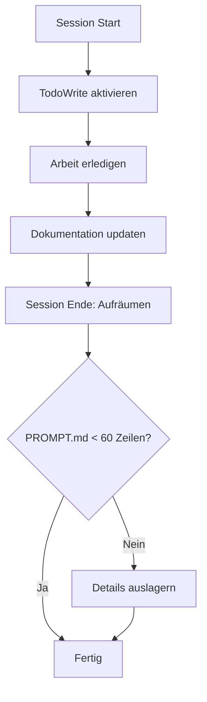

# Entry Point: Session & Documentation Management

> **Navigation**: [Entry Points](README.md) → Session & Documentation Management
> **Zweck**: Claude Code Sessions effizient starten/beenden, Dokumentation pflegen

## 🎯 Wann nutzen?

- [ ] Neue Claude Code Session starten
- [ ] Dokumentation aktualisieren/pflegen
- [ ] TodoWrite-System nutzen
- [ ] Session beenden & aufräumen
- [ ] PROMPT.md pflegen (< 60 Zeilen)

## ⚡ Quick Start

**Session Start → Standards → Status prüfen**

1. **Session starten**: [SESSION_WORKFLOW.md](../how-to/SESSION_WORKFLOW.md)
2. **Standards befolgen**: [CLAUDE_CODE_KONVENTIONEN.md](../reference/CLAUDE_CODE_KONVENTIONEN.md)
3. **Status prüfen**: [TASK_STATUS.md](../reference/TASK_STATUS.md)

---

## 📍 Hauptpfad: Typische Session



### Schritt 1: Session Start
- **Dokument**: [SESSION_WORKFLOW.md](../how-to/SESSION_WORKFLOW.md)
- **Aktionen**:
  1. CLAUDE.md wird automatic geladen
  2. [TASK_STATUS.md](../reference/TASK_STATUS.md) prüfen → 🔵🟡🟢 Migration-Phase
  3. TodoWrite initialisieren für Task-Tracking

**Wichtig**: Keine manuale Kontextladung nötig - CLAUDE.md ist immer verfügbar

### Schritt 2: Arbeit mit Standards
- **Dokument**: [CLAUDE_CODE_KONVENTIONEN.md](../reference/CLAUDE_CODE_KONVENTIONEN.md)
- **Kritische Konventionen**:
  - **Sprache**: Deutsch für Geschäftslogik, Englisch für technische Begriffe
  - **Memory System**: Import-basiert (`@./imports/`)
  - **Bash-Timeouts**: Immer angemessen setzen (3s/5s/10s)
  - **Direktiven**: "Verwende X" statt "X ist verfügbar"

### Schritt 3: Task Tracking mit TodoWrite
- **Dokument**: [TASK_TRACKING.md](../how-to/TASK_TRACKING.md)
- **TodoWrite-Regeln**:
  - Genau 1 Task "in_progress" (nicht mehr, nicht weniger)
  - Tasks sofort als "completed" markieren (kein Batching!)
  - Velocity tracken für Sprint-Planning

**Beispiel**:
```markdown
{"content": "KPI View erstellen", "status": "in_progress", "activeForm": "Erstelle KPI View"}
{"content": "Performance testen", "status": "pending", "activeForm": "Teste Performance"}
```

### Schritt 4: Dokumentation pflegen
- **Dokument**: [DOKUMENTATIONS_WARTUNG.md](../reference/DOKUMENTATIONS_WARTUNG.md)
- **Kritische Regeln**:
  - **PROMPT.md < 60 Zeilen** (Details auslagern nach docs/)
  - **docs/[kategorien]/ synchronisieren** (Diátaxis-Framework)
  - **Keine SQL-Procedures in PROMPT.md**
  - **Keine Migration-Steps in PROMPT.md**

**Diátaxis-Kategorien**:
- `docs/tutorial/` - Lernen (Step-by-Step)
- `docs/how-to/` - Aufgaben (Quick Solutions)
- `docs/reference/` - Nachschlagen (Facts)
- `docs/explanation/` - Verstehen (Architecture)

### Schritt 5: Session Ende
- **Dokument**: [SESSION_WORKFLOW.md](../how-to/SESSION_WORKFLOW.md)
- **End-of-Session Checkliste**:
  - [ ] Alle TodoWrite Tasks "completed"
  - [ ] PROMPT.md bereinigt (< 60 Zeilen)
  - [ ] Cross-References geprüft (keine broken links)
  - [ ] Migration-Phase validiert (🔵🟡🟢 konsistent)
  - [ ] Features validiert (Tests laufen)

---

## 🔀 Spezialfälle

### PROMPT.md > 60 Zeilen
**Problem**: PROMPT.md ist zu groß geworden, verletzt Wartungsregeln

**Diagnose**:
- [DOKUMENTATIONS_WARTUNG.md](../reference/DOKUMENTATIONS_WARTUNG.md) → Quality Assurance
- Zeile 38: "🚨 PROMPT.md < 60 Zeilen"

**Lösung**:
1. **Identifiziere auslagerbaren Content**:
   - SQL-Procedures → `docs/reference/templates/psql-*.md`
   - Migration-Steps → `docs/tutorial/POSTGRESQL_MIGRATION_TECHNISCH.md`
   - KPI-Definitionen → `docs/imports/QUICK_REF.md`
   - Workflows → `docs/how-to/*.md`

2. **Lagere aus**:
   - Verschiebe Details in passenden Diátaxis-Quadrant
   - Behalte nur Direktiven in PROMPT.md

3. **Update CLAUDE.md**:
   - Verweise auf neue Pfade aktualisieren

**Faustregel**: PROMPT.md sollte nur "Was" und "Warum" enthalten, nie "Wie im Detail"

---

### Custom Hooks konfigurieren
**Use Case**: Automatisierung mit Claude Code Hooks

**Dokument**: [CLAUDE_CODE_AUTOMATION.md](../how-to/CLAUDE_CODE_AUTOMATION.md)

**Verfügbare Hooks**:
- `user-prompt-submit-hook` - Vor jedem User-Prompt
- `post-tool-use-hook` - Nach Tool-Nutzung
- `pre-commit-hook` - Vor Git-Commits

**Beispiel-Hook** (user-prompt-submit-hook):
```bash
#!/bin/bash
# Prüfe ob PROMPT.md zu groß ist
LINES=$(wc -l < PROMPT.md)
if [ $LINES -gt 60 ]; then
    echo "⚠️ PROMPT.md hat $LINES Zeilen (> 60). Bitte bereinigen!"
    exit 1
fi
```

**Konfiguration**: `~/.claude/hooks/` oder projekt-spezifisch in `.claude/hooks/`

---

### Dokumentations-Kategorien unklar
**Problem**: Unsicher, wohin ein Dokument gehört (tutorial vs how-to vs reference vs explanation)

**Framework**: [DOKUMENTATIONS_WARTUNG.md](../reference/DOKUMENTATIONS_WARTUNG.md) → Diátaxis-Kategorien

**Decision Tree**:
```
Ist es eine Schritt-für-Schritt Anleitung für Anfänger?
  → Ja: docs/tutorial/

Löst es ein spezifisches Problem?
  → Ja: docs/how-to/

Ist es ein Nachschlagewerk (Fakten, Syntax, Konstanten)?
  → Ja: docs/reference/

Erklärt es "Warum" (Architektur, Designentscheidungen)?
  → Ja: docs/explanation/
```

**Beispiele**:
- "PostgreSQL Migration Guide" → `tutorial/` (Step-by-Step, 3 Wochen)
- "PostgreSQL Daily Ops" → `how-to/` (Tägliche Befehle)
- "Quick Reference KPIs" → `reference/` (Konstanten)
- "Migration Strategie" → `explanation/` (Warum PostgreSQL?)

---

### Kickoff Prompts wiederverwenden
**Use Case**: Neue Session starten mit standardisiertem Kontext

**Dokument**: [KICKOFF_PROMPTS.md](../reference/KICKOFF_PROMPTS.md)

**Verfügbare Prompts**:
- **SQL-Entwicklung**: "Ich arbeite an SQL-Queries/Views"
- **Migration**: "Ich plane die PostgreSQL-Migration"
- **Power BI**: "Ich entwickle Power BI Dashboards"
- **Troubleshooting**: "Ich debugge Performance-Probleme"

**Verwendung**:
```markdown
# Session Kickoff

Kontext: [KICKOFF_PROMPTS.md](../reference/KICKOFF_PROMPTS.md) → SQL-Entwicklung

Aufgabe: Neue KPI View für OrderIntake erstellen
Phase: 🔵 Pre-Migration (SQL Server Express)
```

---

## 📚 Alle relevanten Dokumente

### Tutorial (Lernen)
- Keine Session-Management Tutorials (nutze How-To)

### How-To (Aufgaben)
- [SESSION_WORKFLOW.md](../how-to/SESSION_WORKFLOW.md) - Session-Lifecycle ⭐
- [TASK_TRACKING.md](../how-to/TASK_TRACKING.md) - TodoWrite & Velocity Tracking
- [CLAUDE_CODE_AUTOMATION.md](../how-to/CLAUDE_CODE_AUTOMATION.md) - Hooks & Custom Commands
- [DOKUMENTATIONS_WARTUNG.md](../reference/DOKUMENTATIONS_WARTUNG.md) - Wartungsregeln

### Reference (Nachschlagen)
- [CLAUDE_CODE_KONVENTIONEN.md](../reference/CLAUDE_CODE_KONVENTIONEN.md) - Standards ⭐
- [DOKUMENTATIONS_WARTUNG.md](../reference/DOKUMENTATIONS_WARTUNG.md) - Kategorien ⭐
- [TASK_STATUS.md](../reference/TASK_STATUS.md) - Phase Checklisten (🔵🟡🟢)
- [KICKOFF_PROMPTS.md](../reference/KICKOFF_PROMPTS.md) - Ready-to-use Prompts
- [CLAUDE_CODE_CLI_REFERENZ.md](../reference/CLAUDE_CODE_CLI_REFERENZ.md) - CLI Commands

### Explanation (Verstehen)
- [STRATEGISCHE_VISION.md](../explanation/STRATEGISCHE_VISION.md) - 6-Monats-Roadmap
- [CLAUDE_KONSOLIDIERUNG.md](../explanation/CLAUDE_KONSOLIDIERUNG.md) - CLAUDE.md Evolution

---

## 🔗 Verwandte Entry Points

- **[SQL & Database Development](SQL_DATABASE_DEVELOPMENT.md)** - Wenn du an SQL arbeitest
- **[PostgreSQL Migration](POSTGRESQL_MIGRATION.md)** - Wenn du migrierst
- **[Power BI & Analytics](POWER_BI_ANALYTICS.md)** - Wenn du Dashboards entwickelst

---

**⭐ = Täglich benötigt für Session Management**

## 💡 Best Practices

### TodoWrite Velocity Tracking
```markdown
Sprint 1 (Woche 1): 15 Tasks completed
Sprint 2 (Woche 2): 22 Tasks completed → Velocity +46%
Sprint 3 (Woche 3): 18 Tasks completed → Migration abgeschlossen
```

### PROMPT.md Lifecycle
```
Session Start: 45 Zeilen ✅
Nach 2 Stunden: 58 Zeilen ⚠️
Nach 3 Stunden: 62 Zeilen 🚨 → Details auslagern
Session Ende: 42 Zeilen ✅
```

### Cross-Reference Validation
```bash
# Prüfe alle Markdown-Links
```
