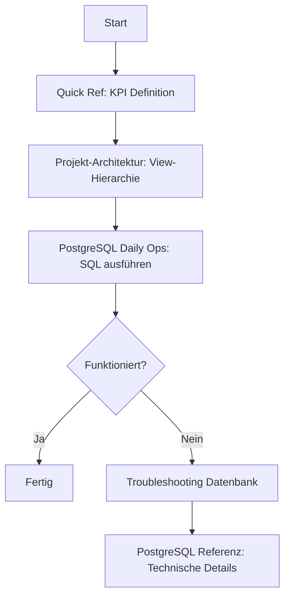

# Entry Point: SQL & Database Development

> **Navigation**: [Entry Points](README.md) → SQL & Database Development
> **Zweck**: Schnelle Navigation für SQL-Queries, Views, KPIs, Performance-Optimierung

## 🎯 Wann nutzen?

- [ ] SQL-Queries schreiben/optimieren
- [ ] Views erstellen/ändern (vw_Dim_*, vw_Fact_*, vw_KPI_*)
- [ ] KPI-Calculationen entwickeln
- [ ] Performance-Probleme troubleshooten
- [ ] Datenbank-Schema verstehen

## ⚡ Quick Start

**Quick Reference → Daily Ops → Deep Dive**

1. **KPI-Konstanten nachschlagen**: [QUICK_REF.md](../imports/QUICK_REF.md)
2. **SQL-Befehle kopieren**: [POSTGRESQL_DAILY_OPS.md](../how-to/POSTGRESQL_DAILY_OPS.md)
3. **Business-Logik verstehen**: [PROJEKT_ARCHITEKTUR.md](../explanation/PROJEKT_ARCHITEKTUR.md)

---

## 📍 Hauptpfad: Neue KPI entwickeln



### Schritt 1: KPI-Definition verstehen
- **Dokument**: [QUICK_REF.md](../imports/QUICK_REF.md)
- **Aktion**: E/S/D/V/C Kategorien prüfen, Calculationslogik nachschlagen
- **Beispiel**: kpi_a = OrderIntake am letzten Arbeitstag

### Schritt 2: View-Hierarchie verstehen
- **Dokument**: [PROJEKT_ARCHITEKTUR.md](../explanation/PROJEKT_ARCHITEKTUR.md)
- **Aktion**: Abhängigkeiten verstehen (Dim → Fact → KPI → PowerBI)
- **Wichtig**: Bottom-Up Approach (niemals direkt auf Basis-Tabellen aggregieren bei 65M+ Rows!)

### Schritt 3: SQL entwickeln & testen
- **Dokument**: [POSTGRESQL_DAILY_OPS.md](../how-to/POSTGRESQL_DAILY_OPS.md)
- **Aktion**: psql-Befehle kopieren, View erstellen/testen
- **Connection Pattern**:
```bash
powershell.exe "$env:PGPASSWORD='${PGPASSWORD}'; & 'C:\\Program Files\\PostgreSQL\\17\\bin\\psql.exe' -h localhost -p 5432 -U postgres -d postgres -c \"YOUR_SQL_HERE\""
```

### Schritt 4: Validieren & Performance prüfen
- **Dokument**: [TROUBLESHOOTING_DATENBANK.md](../how-to/TROUBLESHOOTING_DATENBANK.md)
- **Aktion**:
  - Performance prüfen (Ziel: < 5 Sekunden)
  - Business-Erwartungen validieren (siehe QUICK_REF.md)
  - Row Counts vergleichen

---

## 🔀 Spezialfälle

### Performance-Problem (Query > 5 Sekunden)
**Symptom**: SQL-Query dauert zu lange, DirectQuery in Power BI bricht ab

**Diagnose**:
1. [TROUBLESHOOTING_DATENBANK.md](../how-to/TROUBLESHOOTING_DATENBANK.md) → Performance-Patterns
2. [POSTGRESQL_REFERENZ.md](../reference/POSTGRESQL_REFERENZ.md) → Indexierung

**Häufige Ursachen**:
- Keine Materialized Views für 65M+ Appointment-Tabelle
- Aggregation auf Fact-Ebene statt KPI-Ebene
- Fehlende Indizes auf Join-Spalten

**Lösung**:
```sql
-- Materialized View erstellen für große Tabellen
CREATE MATERIALIZED VIEW vw_fact_expiry_mat AS
SELECT
    appointment_id,
    order_id,
    expiry_date,
    /* weitere Spalten */
FROM appointment
WHERE /* Bedingungen */;

-- Index erstellen
CREATE INDEX idx_expiry_date ON vw_fact_expiry_mat(expiry_date);

-- Regelmäßig refreshen
REFRESH MATERIALIZED VIEW CONCURRENTLY vw_fact_expiry_mat;
```

---

### SQL Server vs PostgreSQL Syntax-Unterschied
**Symptom**: SQL funktioniert in SQL Server Express, aber nicht in PostgreSQL

**Dokumente**:
- [SQL_SERVER_LEGACY.md](../reference/SQL_SERVER_LEGACY.md) - Alte SQL Server Syntax
- [POSTGRESQL_REFERENZ.md](../reference/POSTGRESQL_REFERENZ.md) - Neue PostgreSQL Syntax

**Häufige Unterschiede**:

| SQL Server | PostgreSQL | Notiz |
|------------|------------|-------|
| `GETDATE()` | `CURRENT_TIMESTAMP` | Aktuelles Datum/Zeit |
| `NVARCHAR(n)` | `TEXT` | PostgreSQL nutzt UTF-8 |
| `DATETIME` | `TIMESTAMP` | Zeitstempel |
| `ISNULL(col, 0)` | `COALESCE(col, 0)` | NULL-Behandlung |
| `TOP 10` | `LIMIT 10` | Ergebnislimit |
| `[ColumnName]` | `"ColumnName"` | Identifier-Quoting |
| `dbo.TableName` | `order_processing.table_name` | Schema-Referenz |

**Migration-Guide**: [POSTGRESQL_MIGRATION_TECHNISCH.md](../tutorial/POSTGRESQL_MIGRATION_TECHNISCH.md)

---

### Sentinel-Logik (ProviderGroupID 3/14)
**Use Case**: Provider filtern für Sentinel-spezifische Auswertungen

**Business Rule** (siehe CLAUDE.md):
```sql
-- Sentinel-Erkennung
WHERE ProviderGroupID IN (1, 2)
```

**Dokumente**:
- [PROJEKT_ARCHITEKTUR.md](../explanation/PROJEKT_ARCHITEKTUR.md) → vw_Dim_Provider
- CLAUDE.md → Zentrale Geschäftsregeln

**Anwendungsfälle**:
1. **Auto-Processing Ausschlüsse**: Sentinel-Provider haben oft SourceSystem → kein Auto-Processing
2. **Provideranalyse**: Getrennte KPIs für Sentinel vs Non-Sentinel
3. **Expiration**: Sentinel hat andere appointments-Patterns

**Beispiel-SQL**:
```sql
SELECT
    b.provider_id,
    b.name,
    CASE WHEN b.provider_group_id IN (1, 2) THEN 'Sentinel' ELSE 'Standard' END as typ
FROM vw_dim_provider b;
```

---

### DirectQuery für Power BI
**Use Case**: KPI-View für Power BI DirectQuery optimieren

**Kritische Regel**: Alle Aggregationen in SQL, NICHT in Power BI!

**Dokumente**:
- [POWER_BI_DASHBOARD_ENTWICKLUNG.md](../how-to/POWER_BI_DASHBOARD_ENTWICKLUNG.md) → DirectQuery Patterns
- [POWER_BI_DAX_KATALOG.md](../reference/POWER_BI_DAX_KATALOG.md) → DAX Measures

**Limits**:
- Max 1M Rows pro Visual
- < 5 Sekunden Ladezeit
- Keine Post-Aggregation in DAX

**Optimierungs-Pattern**:
```sql
-- ❌ FALSCH: Rohdaten an Power BI senden
CREATE VIEW vw_powerbi_raw AS
SELECT * FROM appointment; -- 65M+ Rows!

-- ✅ RICHTIG: Pre-Aggregation in SQL
CREATE VIEW vw_powerbi_dashboard_live AS
SELECT
    DATE(erstellt_am) as datum,
    COUNT(*) as count_orders,
    SUM(net_amount) as gesamtwert,
    AVG(bearbeitungszeit_tage) as avg_bearbeitungszeit
FROM vw_fact_order
GROUP BY DATE(erstellt_am);
```

**Siehe auch**: [Power BI & Analytics Entry Point](POWER_BI_ANALYTICS.md)

---

## 📚 Alle relevanten Dokumente

### Tutorial (Lernen)
- [POSTGRESQL_MIGRATION_TECHNISCH.md](../tutorial/POSTGRESQL_MIGRATION_TECHNISCH.md) - Schema-Conversion Patterns

### How-To (Aufgaben)
- [POSTGRESQL_DAILY_OPS.md](../how-to/POSTGRESQL_DAILY_OPS.md) - Tägliche SQL-Operationen ⭐
- [POSTGRESQL_AUTOMATION.md](../how-to/POSTGRESQL_AUTOMATION.md) - Emergency Response, Daily Sync
- [TROUBLESHOOTING_DATENBANK.md](../how-to/TROUBLESHOOTING_DATENBANK.md) - Performance-Patterns ⭐
- [POWER_BI_DASHBOARD_ENTWICKLUNG.md](../how-to/POWER_BI_DASHBOARD_ENTWICKLUNG.md) - DirectQuery Optimization

### Reference (Nachschlagen)
- [QUICK_REF.md](../imports/QUICK_REF.md) - KPI-Definitionen ⭐
- [POSTGRESQL_REFERENZ.md](../reference/POSTGRESQL_REFERENZ.md) - Vollständige PostgreSQL Referenz
- [SQL_SERVER_LEGACY.md](../reference/SQL_SERVER_LEGACY.md) - SQL Server Express Limits & Bugs
- [TASK_STATUS.md](../reference/TASK_STATUS.md) - Aktuelle Migration-Phase (🔵🟡🟢)
- [templates/PSQL_CORE.md](../reference/templates/PSQL_CORE.md) - SQL-Templates ⭐
- [templates/PSQL_PATTERNS.md](../reference/templates/PSQL_PATTERNS.md) - Design Patterns
- [templates/PSQL_DAILY.md](../reference/templates/PSQL_DAILY.md) - Daily Operations
- [templates/PSQL_ERRORS.md](../reference/templates/PSQL_ERRORS.md) - Error Handling

### Explanation (Verstehen)
- [PROJEKT_ARCHITEKTUR.md](../explanation/PROJEKT_ARCHITEKTUR.md) - System-Design, Business Logic ⭐
- [MIGRATION_STRATEGIE.md](../explanation/MIGRATION_STRATEGIE.md) - Warum PostgreSQL, Risiken

---

## 🔗 Verwandte Entry Points

- **[PostgreSQL Migration](POSTGRESQL_MIGRATION.md)** - Wenn du Views migrierst
- **[Power BI & Analytics](POWER_BI_ANALYTICS.md)** - Wenn du für DirectQuery entwickelst
- **[Session Management](SESSION_DOCUMENTATION_MANAGEMENT.md)** - Session-Workflow & TodoWrite

---

**⭐ = Häufig benötigt für SQL-Entwicklung**
