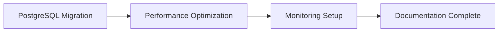
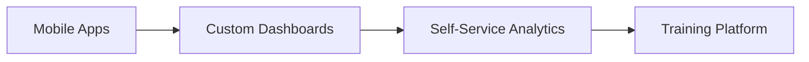
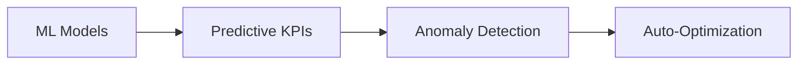

# PLAN.md - Strategische Vision & Roadmap

> **Navigation**: [CLAUDE.md](../../CLAUDE.md) → PLAN.md | **Status**: Langfristige Strategie  
> **Operative Umsetzung**: Siehe [TASK.md](../reference/TASK_STATUS.md) für konkrete Aufgaben

## 📑 Inhaltsverzeichnis

- [🎯 Vision & Mission](#vision--mission)
- [📊 Strategische Ziele](#strategische-ziele)
- [🗺️ 6-Monats-Roadmap](#6-monats-roadmap)
- [🚀 Innovations-Pipeline](#innovations-pipeline)
- [📈 Success Metrics](#success-metrics)
- [🌟 Zukunftsvision](#zukunftsvision)
- [🎯 Strategische Initiativen](#strategische-initiativen)
- [📊 Investment Priorities](#investment-priorities)
- [🏁 Next Steps](#next-steps)

## 🎯 VISION & MISSION {#vision--mission}

### Vision Statement
> "Ein referenzwürdiges KPI-Dashboard-System für mehrstufige Document-Processing-Backoffices —
> vollautomatisiert, echtzeitfähig und vorausschauend."

### Mission
Wir transformieren die manuale OrderProcessing durch:
- **Echtzeit-Transparenz** über alle Prozessschritte
- **Automatisierte Insights** statt manualer Reports  
- **Proaktive Steuerung** statt reaktiver Brandbekämpfung
- **KI-gestützte Optimierung** aller Workflows

### Kernwerte
- **Zuverlässigkeit**: 99.9% Verfügbarkeit
- **Performance**: <3 Sekunden für jede Abfrage
- **Skalierbarkeit**: Von 1 bis 100 Backoffices  
- **Innovation**: Kontinuierliche Verbesserung

## 📊 STRATEGISCHE ZIELE {#strategische-ziele}

### Q1 2025: Foundation (🔵→🟡)
**Ziel**: Stabile technische Basis schaffen

- ✅ SQL Server Express Limitierungen überwinden
- ✅ PostgreSQL Migration erfolgreich
- ✅ 10x Performance-Verbesserung
- ✅ Vollständige KPI-Validierung

**Status**: In Umsetzung (siehe [MIGRATION.md](../tutorial/POSTGRESQL_MIGRATION_GUIDE.md))

### Q2 2025: Excellence (🟢)
**Ziel**: Operative Exzellenz erreichen

- 📊 **Real-time Dashboards** (<1 Sek Updates)
- 🤖 **KI-Assistant Integration** (80% Automation)
- 📱 **Mobile-First Design** (iOS/Android Apps)
- 🔔 **Proaktive Alerts** (Predictive Warnings)

### Q3 2025: Innovation
**Ziel**: Neue Geschäftsmöglichkeiten

- 🧠 **Machine Learning KPIs** (Prognose-Modelle)
- 🔗 **API-Ökosystem** (Partner-Integration)
- ☁️ **Cloud-Native Architecture** (Multi-Tenant)
- 📊 **Benchmarking-Service** (Branchenvergleiche)

### Q4 2025: Scale
**Ziel**: Marktführerschaft

- 🏢 **Multi-Mandanten-Fähigkeit**
- 🌍 **SaaS-Offering** (KPI-Dashboard as a Service)
- 🏆 **Best-Practice Templates** (Industrie-Standards)
- 🎓 **Training & Certification** (Partner-Programm)

## 🗺️ 6-MONATS-ROADMAP {#6-monats-roadmap}

### Monat 1-2: Technical Excellence


**Fokus-Bereiche**:
- Migration abschließen → [MIGRATION.md](../tutorial/POSTGRESQL_MIGRATION_GUIDE.md)
- Query-Performance <1 Sek
- Automated Testing 100%
- Zero-Downtime Deployments

### Monat 3-4: User Experience


**Fokus-Bereiche**:
- Native Mobile Apps (React Native)
- Drag-and-Drop Dashboard Builder
- Guided Analytics für Business User
- Video-Tutorials & Documentation

### Monat 5-6: Intelligence Layer


**Fokus-Bereiche**:
- Forecast-Modelle für alle KPIs
- Automatische Anomalie-Erkennung
- Workflow-Optimierung via ML
- Natural Language Queries

## 🚀 INNOVATIONS-PIPELINE {#innovations-pipeline}

### Near-term (3-6 Monate)

#### 1. Conversational Analytics
```python
# Beispiel-Interface
"Zeige mir alle kritischen Expiryen für nächste Woche"
→ Automatische Query-Generierung
→ Visualisierung
→ Handlungsempfehlungen
```

#### 2. Process Mining Integration
- Automatische Prozess-Analyse
- Bottleneck-Identifikation
- Optimierungsvorschläge
- ROI-Calculation

#### 3. Blockchain-Audit-Trail
- Unveränderliche KPI-Historie
- Compliance-Nachweis
- Partner-Vertrauen
- Regulatorische Sicherheit

### Long-term (6-12 Monate)

#### 1. Digital Twin
- Virtuelles Abbild der Pipeline-Stufen
- What-if Szenarien für Volume-Spitzen
- Kapazitätsplanung pro Stage
- Risiko-Simulation für Frist-Überschreitungen

#### 2. Augmented Reality Dashboards
- AR-Brillen Integration
- 3D-Visualisierungen
- Hands-free Operation
- Immersive Analytics

#### 3. Quantum-Ready Architecture
- Post-Quantum Cryptography
- Quantum-Algorithm Integration
- Future-Proof Security
- Exponential Scaling

## 📈 SUCCESS METRICS {#success-metrics}

### Technical KPIs
| Metrik | Current | Target Q2 | Target Q4 |
|--------|---------|-----------|-----------|
| Query Response | 30s | <1s | <500ms |
| Availability | 95% | 99.5% | 99.9% |
| Automation Rate | 10% | 60% | 80% |
| Test Coverage | 40% | 90% | 95% |

### Business KPIs
| Metrik | Current | Target Q2 | Target Q4 |
|--------|---------|-----------|-----------|
| User Satisfaction | 3.2/5 | 4.5/5 | 4.8/5 |
| Time to Insight | 2h | 10min | 1min |
| Manual Effort | 80% | 30% | 10% |
| Error Rate | 5% | 1% | 0.1% |

### Innovation KPIs
| Metrik | Current | Target Q2 | Target Q4 |
|--------|---------|-----------|-----------|
| ML Model Accuracy | - | 85% | 95% |
| Predictive Alerts | 0 | 10/day | 50/day |
| API Integrations | 0 | 5 | 20 |
| Partner Ecosystem | 0 | 3 | 10 |

## 🌟 ZUKUNFTSVISION {#zukunftsvision}

### 2026: Reference status
- **Profile**: Veröffentlichte Reference-Implementation
- **Anwendbarkeit**: Mehrere Domänen (Claims, Legal, Logistics, B2B-Order)
- **Technologie**: Cloud-Native, KI-First
- **Community**: Showcase-Repo + Beispiel-Workflows

### 2027: Internationale Expansion  
- **Märkte**: DACH + BeNeLux + Nordics
- **Sprachen**: DE, EN, NL, FR
- **Compliance**: EU-weit zertifiziert
- **Umsatz**: €10M ARR

### 2028: Plattform-Ökosystem
- **App Store**: 100+ Integrationen
- **Developer Community**: 500+ Entwickler
- **API Calls**: 1B+/Monat
- **Market Cap**: €100M+

## 🎯 STRATEGISCHE INITIATIVEN {#strategische-initiativen}

### Initiative 1: Zero-Touch Operations
**Ziel**: Vollautomatisierter Betrieb ohne manuale Eingriffe

- Self-Healing Systems
- Predictive Maintenance
- Auto-Scaling
- Autonomous Optimization

### Initiative 2: Data Democracy
**Ziel**: Jeder Mitarbeiter wird zum Daten-Analysten

- No-Code Analytics
- Natural Language Queries
- Automated Insights
- Collaborative Dashboards

### Initiative 3: Ecosystem Play
**Ziel**: Offene Plattform für Innovation

- Public APIs
- Partner Marketplace
- Revenue Sharing
- Co-Innovation Labs

## 📊 INVESTMENT PRIORITIES {#investment-priorities}

### Kurzfristig (0-6 Monate)
1. **PostgreSQL Infrastructure**: €50k
2. **Mobile Development**: €80k
3. **ML/AI Capabilities**: €100k
4. **Security & Compliance**: €70k

### Mittelfristig (6-18 Monate)
1. **Cloud Migration**: €200k
2. **Platform Development**: €300k
3. **Market Expansion**: €250k
4. **Team Growth**: €500k

### Return on Investment
- **Jahr 1**: Break-even
- **Jahr 2**: 200% ROI
- **Jahr 3**: 500% ROI
- **Jahr 5**: 1000% ROI

## 🏁 NEXT STEPS {#next-steps}

### Sofort (Diese Woche)
→ Siehe [TASK.md](../reference/TASK_STATUS.md) für operative Aufgaben

### Strategisch (Dieser Monat)
1. PostgreSQL Migration abschließen
2. ML-Team aufbauen
3. Mobile App Prototyp
4. Partner-Gespräche starten

### Visionär (Dieses Jahr)
1. Series A Funding
2. Internationale Expansion
3. IPO-Vorbereitung
4. Industry Awards

---
**📚 DOKUMENTEN-NAVIGATION**:
- **🏠 Start**: [CLAUDE.md](../../CLAUDE.md) - Master-Index
- **✅ Umsetzung**: [TASK.md](../reference/TASK_STATUS.md) - Operative Aufgaben
- **🚀 Migration**: [MIGRATION.md](../tutorial/POSTGRESQL_MIGRATION_GUIDE.md) - 3-Wochen-Plan
- **🔧 Technik**: [PSQL.md](../reference/POSTGRESQL_REFERENZ.md) - PostgreSQL Details
- **📋 Vision**: PLAN.md (diese Datei) - Strategische Planung
- **🔍 Wissen**: [KNOWLEDGE.md](../reference/SQL_SERVER_LEGACY.md) - Troubleshooting
- **🏗️ System**: [PROJECT.md](PROJEKT_ARCHITEKTUR.md) - Architektur
- **📊 Frontend**: [DASHBOARD.md](../how-to/POWER_BI_DASHBOARD_ENTWICKLUNG.md) - Power BI

---
*Status: Strategische Vision für KPI-Dashboard Evolution*  
*Horizont: 6 Monate operativ, 3 Jahre visionär*  
*Letzte Aktualisierung: 2025-07-07*