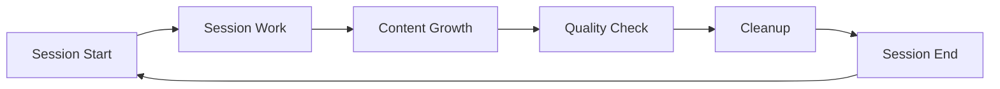

# PROMPT_LIFECYCLE.md - Wartungszyklen & Cleanupsrichtlinien

*Erstellt am: 2025-07-18*
*Fokus: Systematische PROMPT.md Wartung und Dokumentations-Lifecycle*

## 🎯 Zweck

Dieses Dokument definiert die systematischen Wartungszyklen für PROMPT.md und das gesamte Dokumentationssystem, um eine kontinuierlich saubere und wartbare Dokumentationsstruktur zu gewährleisten.

## 📋 Inhaltsverzeichnis

- [📊 Dokumentations-Kategorien-Management](#dokumentations-kategorien-management)
- [⏰ Wartungszyklen](#wartungszyklen)
- [🚨 Automatische Qualitätschecks](#automatice-qualitätschecks)
- [📈 Metriken & Monitoring](#metriken--monitoring)
- [🔧 Cleanupstools](#cleanupstools)


### Lifecycle-Phasen



### Phase 1: Session Start
**Ziel**: Sauberer Start mit fokussierten Prioritäten

**Checks:**
```bash
# Zeilenzahl prüfen
wc -l PROMPT.md | awk '{if ($1 > 60) print "🚨 PROMPT.md zu lang: " $1 " Zeilen (max 60)"; else print "✅ PROMPT.md OK: " $1 " Zeilen"}'

# Veraltete Inhalte identifizieren
grep -n "abgeschlossen\|deprecated\|legacy\|alt" PROMPT.md
```

**Cleanup falls nötig:**
- Abgeschlossene Tasks → docs/task-management/TASK.md
- SQL-Details → docs/data-platform/PSQL.md
- Migration-Details → docs/migration/MIGRATION.md
- Geschäftsregeln → docs/core/PROJECT.md

### Phase 2: Session Work
**Ziel**: Kontrolliertes Wachstum während der Arbeit

**Leitregeln:**
- Neue Prioritäten ersetzen alte (nicht anhängen)
- Detaillierte Lösungen sofort in entsprechende Kategorie auslagern
- Maximale 5 aktive Prioritäten gleichzeitig
- Jede Ergänzung prüfen: "Gehört das wirklich in PROMPT.md?"

### Phase 3: Content Growth Monitoring
**Ziel**: Rechtzeitige Erkennung von Überwachsung

**Warnsignale:**
- PROMPT.md > 50 Zeilen → Warnung
- PROMPT.md > 60 Zeilen → Sofort bereinigen
- Detaillierte SQL-Procedures → Auslagern
- Längere Erklärungen → Auslagern
- Abgeschlossene Tasks → Archivieren

### Phase 4: Quality Check
**Ziel**: Systematische Qualitätskontrolle

**Checkliste:**
```markdown
✅ PROMPT.md < 60 Zeilen
✅ Nur aktuelle Session-Prioritäten
✅ Alle Details in entsprechende Kategorien ausgelagert
✅ Cross-References funktional
✅ Keine abgeschlossenen Tasks
✅ Keine redundanten Inhalte
```

### Phase 5: Cleanup
**Ziel**: Systematische Cleanup und Auslagerung

**Cleanupsmatrix:**
| Inhalt | Ziel-Kategorie | Aktion |
|--------|---------------|--------|
| SQL-Procedures | docs/data-platform/PSQL.md | Verschieben |
| Migration-Tasks | docs/migration/MIGRATION.md | Verschieben |
| KPI-Definitionen | docs/core/PROJECT.md | Verschieben |
| Strategische Ziele | docs/task-management/PLAN.md | Verschieben |
| Abgeschlossene Tasks | docs/task-management/TASK.md | Archivieren |

### Phase 6: Session End
**Ziel**: Sauberer Abschluss für nächste Session

**Finalization:**
- PROMPT.md auf Kern-Prioritäten reduziert
- Alle relevanten Details ausgelagert
- Cross-References aktualisiert
- Nächste Session vorbereitet

## 📊 DOKUMENTATIONS-KATEGORIEN-MANAGEMENT {#dokumentations-kategorien-management}

### Kategorien-Aufgaben

#### **docs/task-management/**: Session-Management
**Wartungsfrequenz**: Bei jeder Session

**Inhalte:**
- Operative Aufgaben und Prioritäten
- Strategische Vision und Roadmap
- Session-Lifecycle-Management
- Cleanupsrichtlinien

**Qualitätskriterien:**
- TASK.md: Migrationsphasen (🔵🟡🟢) konsistent
- PLAN.md: Strategische Ziele aktuell
- SESSION_MANAGEMENT.md: Workflow-Richtlinien vollständig
- PROMPT_LIFECYCLE.md: Cleanupszyklen definiert

#### **docs/core/**: System-Dokumentation
**Wartungsfrequenz**: Bei Geschäftslogik-Änderungen

**Inhalte:**
- System-Architektur und Datenmodell
- Geschäftsregeln und KPI-Definitionen
- Wissensdatenbank und Troubleshooting
- Best Practices und Standards

**Qualitätskriterien:**
- PROJECT.md: KPI-Definitionen aktuell und validiert
- Alle Geschäftsregeln referenzierbar
- Performance-Baselines dokumentiert

#### **docs/migration/**: Zeitlich begrenzte Dokumentation
**Wartungsfrequenz**: Während Migration-Phasen

**Inhalte:**
- 3-Wochen-Timeline für SQL Server → PostgreSQL
- Deployment-Strategien und Go-Live-Procedures
- Validierung und Rollback-Pläne
- Migration-spezifische Troubleshooting

**Qualitätskriterien:**
- MIGRATION.md: Timeline und Phasen-Status aktuell
- DEPLOYMENT.md: Procedures getestet und validiert
- Nach Migration: Archivierung oder Transformation zu Maintenance-Docs

#### **docs/data-platform/**: SQL/Power BI Dokumentation
**Wartungsfrequenz**: Bei jeder SQL/BI-Änderung

**Inhalte:**
- PostgreSQL Daily Operations (kompakt)
- Vollständige PostgreSQL-Referenz
- Power BI DirectQuery-Patterns und DAX-Measures
- Performance-Optimierung und Monitoring

**Qualitätskriterien:**
- PSQL.md: Tägliche Operationen < 300 Zeilen
- PSQL_TEMPLATE.md: Vollständige Referenz aktuell
- DASHBOARD.md: DirectQuery-Patterns validiert
- Performance-Metriken aktuell

#### **docs/operations/**: Claude Code Dokumentation
**Wartungsfrequenz**: Bei Claude Code Updates

**Inhalte:**
- Claude Code Basis-Konventionen
- Erweiterte Workflows und Automation
- Memory-Management und Import-Strategien
- Bash-Timeout-Konfiguration

**Qualitätskriterien:**
- CC_CONVENTIONS.md: Projektspezifische Anpassungen aktuell
- CC_CONVENTIONS_WORKFLOWS.md: Workflows getestet
- Memory-Management < 500 Zeilen pro Datei
- Bash-Timeout-Richtlinien befolgt

## ⏰ WARTUNGSZYKLEN {#wartungszyklen}

### Täglich (Bei jeder Session)
**Ziel**: PROMPT.md sauber halten

```bash
# Daily PROMPT.md Check
echo "=== Daily PROMPT.md Maintenance ===" 
wc -l PROMPT.md
if [ $(wc -l < PROMPT.md) -gt 60 ]; then
    echo "🚨 PROMPT.md zu lang - Cleanup erforderlich"
    echo "Auslagerung nach:"
    echo "- SQL-Details → docs/data-platform/PSQL.md"
    echo "- Migration-Tasks → docs/migration/MIGRATION.md"
    echo "- Geschäftsregeln → docs/core/PROJECT.md"
    echo "- Operative Aufgaben → docs/task-management/TASK.md"
fi
```

### Wöchentlich (Ende Sprint)
**Ziel**: Kategorie-Konsistenz sicherstellen

```bash
# Weekly Documentation Health Check
echo "=== Weekly Documentation Health Check ==="

# Cross-References validieren
echo "Checking cross-references..."
grep -r "\[.*\](" docs/ | grep -v ".git" | wc -l

# Migrationsphasen-Konsistenz
echo "Checking migration phase consistency..."
grep -r "🔵\|🟡\|🟢" docs/ | wc -l

# Performance-Metriken Aktualität
echo "Checking performance metrics..."
grep -r "performance\|Performance" docs/data-platform/ | wc -l
```

### Monatlich (Ende Iteration)
**Ziel**: Strategische Dokumentation aktualisieren

```bash
# Monthly Strategic Review
echo "=== Monthly Strategic Documentation Review ==="

# PLAN.md Ziele mit TASK.md abgleichen
echo "Reviewing strategic alignment..."
grep -n "Ziel\|Goal" docs/task-management/PLAN.md

# KPI-Definitionen mit aktuellen Views validieren
echo "Validating KPI definitions..."
grep -n "KPI" docs/core/PROJECT.md

# Performance-Baselines aktualisieren
echo "Updating performance baselines..."
grep -n "baseline\|Baseline" docs/data-platform/
```

### Quartalsweise (Ende Major Release)
**Ziel**: Architektur-Dokumentation überprüfen

```bash
# Quarterly Architecture Review
echo "=== Quarterly Architecture Documentation Review ==="

# Veraltete Dokumentation identifizieren
find docs/ -name "*.md" -mtime +90 -exec echo "Old: {}" \;

# Kategorien-Struktur optimieren
echo "Reviewing category structure..."
find docs/ -type d -exec echo "Category: {}" \;

# Migration-Dokumentation archivieren (falls Migration abgeschlossen)
if grep -q "🟢.*completed" docs/migration/MIGRATION.md; then
    echo "Migration completed - consider archiving migration docs"
fi
```

## 🚨 AUTOMATISCHE QUALITÄTSCHECKS {#automatice-qualitätschecks}

### Pre-Session Checks

```bash
#!/bin/bash
# pre-session-check.sh

echo "=== Pre-Session Quality Checks ==="

# PROMPT.md Zeilen-Check
LINES=$(wc -l < PROMPT.md)
if [ $LINES -gt 60 ]; then
    echo "🚨 PROMPT.md: $LINES Zeilen (max 60) - Cleanup erforderlich"
    exit 1
else
    echo "✅ PROMPT.md: $LINES Zeilen - OK"
fi

# Navigation-Links Check
BROKEN_LINKS=$(grep -r "\[.*\](" docs/ | grep -v ".git" | grep -v "http" | while read line; do
    FILE=$(echo "$line" | cut -d: -f1)
    LINK=$(echo "$line" | grep -o '\[.*\]([^)]*)' | sed 's/.*](//' | sed 's/).*//')
    if [ ! -f "$FILE/../$LINK" ] && [ ! -f "$LINK" ]; then
        echo "Broken: $line"
    fi
done | wc -l)

if [ $BROKEN_LINKS -gt 0 ]; then
    echo "🚨 $BROKEN_LINKS gebrochene Links gefunden"
    exit 1
else
    echo "✅ Navigation-Links - OK"
fi

# Migrationsphasen-Konsistenz
PHASE_INCONSISTENCIES=$(grep -r "🔵\|🟡\|🟢" docs/ | cut -d: -f2 | sort | uniq -c | sort -nr | head -1 | awk '{print $1}')
echo "✅ Migrationsphasen-Konsistenz - OK ($PHASE_INCONSISTENCIES Referenzen)"

echo "=== Pre-Session Checks Complete ==="
```

### Post-Session Checks

```bash
#!/bin/bash
# post-session-check.sh

echo "=== Post-Session Quality Validation ==="

# TodoWrite Status Check
echo "Checking TodoWrite completion..."
# (Integration with TodoWrite system)

# Documentation Update Verification
echo "Verifying documentation updates..."
git diff --name-only docs/ | while read file; do
    echo "Updated: $file"
done

# Cross-Reference Validation
echo "Validating cross-references..."
grep -r "\[.*\](" docs/ | grep -v ".git" | wc -l

# PROMPT.md Final Check
FINAL_LINES=$(wc -l < PROMPT.md)
if [ $FINAL_LINES -gt 60 ]; then
    echo "🚨 PROMPT.md noch nicht bereinigt: $FINAL_LINES Zeilen"
    exit 1
else
    echo "✅ PROMPT.md bereinigt: $FINAL_LINES Zeilen"
fi

echo "=== Post-Session Validation Complete ==="
```

## 📈 METRIKEN & MONITORING {#metriken--monitoring}

### Dokumentations-Metriken

| Metrik | Ziel | Aktuell | Trend |
|--------|------|---------|-------|
| PROMPT.md Zeilen | <60 | - | - |
| Gebrochene Links | 0 | - | - |
| Veraltete Docs (>90 Tage) | <5 | - | - |
| Kategorien-Konsistenz | >95% | - | - |
| Cross-References | >50 | - | - |

### Session-Qualitäts-Metriken

| Metrik | Ziel | Aktuell | Trend |
|--------|------|---------|-------|
| Session-Cleanup | 100% | - | - |
| TodoWrite Completion | >90% | - | - |
| Documentation Updates | >80% | - | - |
| Navigation-Konsistenz | 100% | - | - |

### Performance-Metriken

| Metrik | Ziel | Aktuell | Trend |
|--------|------|---------|-------|
| PROMPT.md Wartungszeit | <5 min | - | - |
| Cross-Reference Update | <10 min | - | - |
| Kategorien-Sync | <15 min | - | - |
| Quality Check | <5 min | - | - |

## 🔧 BEREINIGUNGSTOOLS {#cleanupstools}

### PROMPT.md Cleanupshelfer

```bash
#!/bin/bash
# prompt-cleanup.sh

echo "=== PROMPT.md Cleanupshelfer ==="

# Backup erstellen
cp PROMPT.md PROMPT.md.backup

# Zeilen-Check
LINES=$(wc -l < PROMPT.md)
echo "Aktuelle Zeilen: $LINES"

if [ $LINES -gt 60 ]; then
    echo "🚨 Cleanup erforderlich"
    echo ""
    echo "Auslagerungs-Empfehlungen:"
    
    # SQL-Details identifizieren
    if grep -q "SELECT\|UPDATE\|INSERT\|CREATE" PROMPT.md; then
        echo "- SQL-Details → docs/data-platform/PSQL.md"
    fi
    
    # Migration-Tasks identifizieren
    if grep -q "migration\|Migration\|🔵\|🟡\|🟢" PROMPT.md; then
        echo "- Migration-Tasks → docs/migration/MIGRATION.md"
    fi
    
    # Geschäftsregeln identifizieren
    if grep -q "KPI\|Geschäftsregel\|Business" PROMPT.md; then
        echo "- Geschäftsregeln → docs/core/PROJECT.md"
    fi
    
    # Operative Aufgaben identifizieren
    if grep -q "TODO\|Task\|Aufgabe" PROMPT.md; then
        echo "- Operative Aufgaben → docs/task-management/TASK.md"
    fi
    
    echo ""
    echo "Bitte manual bereinigen und dann erneut prüfen."
else
    echo "✅ PROMPT.md innerhalb der 60-Zeilen-Grenze"
fi
```

### Kategorien-Sync-Tool

```bash
#!/bin/bash
# category-sync.sh

echo "=== Kategorien-Synchronisation ==="

# docs/task-management/ Sync
echo "Syncing task-management..."
if [ -f "docs/task-management/TASK.md" ]; then
    echo "✅ TASK.md gefunden"
else
    echo "🚨 TASK.md fehlt"
fi

# docs/core/ Sync
echo "Syncing core documentation..."
    echo "✅ Core docs komplett"
else
    echo "🚨 Core docs unvollständig"
fi

# docs/migration/ Sync
echo "Syncing migration documentation..."
if [ -f "docs/migration/MIGRATION.md" ] && [ -f "docs/migration/DEPLOYMENT.md" ]; then
    echo "✅ Migration docs komplett"
else
    echo "🚨 Migration docs unvollständig"
fi

# docs/data-platform/ Sync
echo "Syncing data-platform documentation..."
if [ -f "docs/data-platform/PSQL.md" ] && [ -f "docs/data-platform/DASHBOARD.md" ]; then
    echo "✅ Data-platform docs komplett"
else
    echo "🚨 Data-platform docs unvollständig"
fi

echo "=== Kategorien-Synchronisation Complete ==="
```

---

**📚 DOKUMENTEN-NAVIGATION**:
- **🏠 Start**: [CLAUDE.md](../../CLAUDE.md) - Master-Index
- **📋 Aufgaben**: [TASK.md](../reference/TASK_STATUS.md) - Operative TODOs
- **🚀 Vision**: [PLAN.md](../reference/TASK_STATUS.md) - Strategische Planung
- **⚙️ Session**: [SESSION_MANAGEMENT.md](SESSION_WORKFLOW.md) - Session-Lifecycle
- **🔄 Wartung**: PROMPT_LIFECYCLE.md (diese Datei) - Cleanupszyklen

**🔄 Wartungs-Workflow:**
1. **Pre-Session**: Qualitätschecks und PROMPT.md Cleanup
2. **Session**: Kontrolliertes Wachstum und sofortige Auslagerung
3. **Post-Session**: Kategorien-Sync und Final Validation
4. **Periodisch**: Strategische Reviews und Architektur-Updates

---
*Status: Vollständiger Dokumentations-Lifecycle für SQL/Power BI Projekt*  
*Fokus: Automatisierte Qualitätschecks, Cleanupszyklen, Metriken*  
*Letzte Aktualisierung: 2025-07-18*