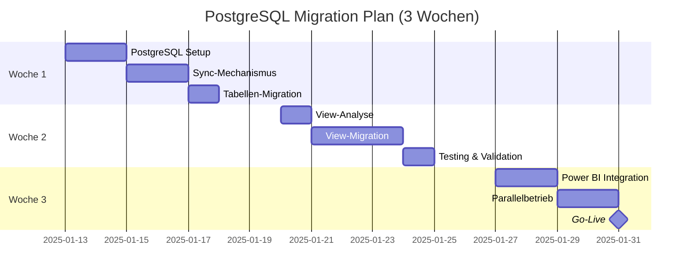

# MIGRATION.md - PostgreSQL Migration Strategic Plan

> **Navigation**: [CLAUDE.md](../../CLAUDE.md) → MIGRATION.md | **Status**: 3-Wochen Migrationsplan
> **Technische Details**: Siehe [PostgreSQL-Referenz](../reference/POSTGRESQL_REFERENZ.md) für Implementierung

## 📑 Inhaltsverzeichnis

- [🎯 Executive Summary](#executive-summary)
- [📊 Migration Timeline](#migration-timeline)
- [🗓️ Woche 1: Setup & Sync](#woche-1-setup--sync)
- [🗓️ Woche 2: Views & Validation](#woche-2-views--validation)
- [🗓️ Woche 3: Power BI & Go-Live](#woche-3-power-bi--go-live)
- [✅ Erfolgskriterien](#erfolgskriterien)
- [🚨 Risiken & Mitigationen](#risiken--mitigationen)
- [🔄 Rollback-Plan](#rollback-plan)

## 🎯 EXECUTIVE SUMMARY {#executive-summary}

### Warum PostgreSQL?
- **Problem**: SQL Server Express nutzt nur 1GB von 64GB RAM (1,5%!)
- **Lösung**: PostgreSQL nutzt volle Hardware-Kapazität
- **Benefit**: 10-50x Performance-Verbesserung bei KPI-Calculationen

### Migration-Strategie
```
SQL Server Express (Prod) → Bleibt als Datenquelle
           ↓
    Täglicher Sync (2:00 MEZ)
           ↓
PostgreSQL (Analytics) → Neue KPI-Processing Engine
           ↓
      Power BI → Unveränderte Oberfläche
```

### Kernprinzipien
- ✅ **Zero Downtime**: Parallelbetrieb während Migration
- ✅ **Incremental Approach**: Schrittweise Validierung
- ✅ **Rollback Ready**: Jederzeit zurück zu SQL Server möglich
- ✅ **KI-Assistant Driven**: Automatisierte Migration

## 📊 MIGRATION TIMELINE {#migration-timeline}



## 🗓️ WOCHE 1: SETUP & SYNC {#woche-1-setup--sync}

### Tag 1-2: PostgreSQL Installation & Setup
**Verantwortlich**: KI-Assistant + DBA

- [ ] PostgreSQL 15+ Installation
- [ ] Hardware-Optimierung (64GB RAM)
- [ ] User & Permissions Setup
- [ ] Monitoring-Tools Installation

**Technische Umsetzung**: [PostgreSQL-Referenz - Setup & Configuration](../reference/POSTGRESQL_REFERENZ.md#postgresql-setup)

### Tag 3-4: Sync-Mechanismus etablieren
**Verantwortlich**: KI-Assistant automatisiert

- [ ] SQL Server Export-Procedures
- [ ] Transfer-Mechanismus (SSIS/Scripts)
- [ ] PostgreSQL Import-Procedures
- [ ] Incremental Sync Testing

**Technische Umsetzung**: [PostgreSQL-Referenz - Daily Operations](../reference/POSTGRESQL_REFERENZ.md)

### Tag 5: Tabellen-Migration
**Verantwortlich**: KI-Assistant via psql

- [ ] Schema-Konvertierung (Datentypen)
- [ ] Initial Data Load (Vollständig)
- [ ] Partitionierung große Tabellen
- [ ] Constraint & Index Migration

**Technische Umsetzung**: [PostgreSQL-Referenz - Migration Commands](../reference/POSTGRESQL_REFERENZ.md)

### Woche 1 - Meilensteine
✅ PostgreSQL läuft mit optimaler Konfiguration  
✅ Täglicher Sync funktioniert zuverlässig  
✅ Alle Tabellen migriert und synchron

## 🗓️ WOCHE 2: VIEWS & VALIDATION {#woche-2-views--validation}

### Tag 6-7: View-Analyse & Vorbereitung
**Verantwortlich**: Business Analyst + KI-Assistant

- [ ] Bestehende Views inventarisieren
- [ ] Geschäftslogik dokumentieren
- [ ] PostgreSQL-Optimierungen planen
- [ ] Materialized View Kandidaten

**View-Kategorien**:
- `vw_Dim_*` → Basis-Dimensionen
- `vw_Fact_*` → Faktentabellen
- `vw_KPI_*` → Geschäftslogik
- `vw_PowerBI_*` → Optimierte Ausgabe

### Tag 8-10: View-Migration & Optimierung
**Verantwortlich**: KI-Assistant automatisiert

- [ ] PostgreSQL-optimierte Views erstellen
- [ ] CTEs statt Subqueries nutzen
- [ ] Window Functions implementieren
- [ ] Materialized Views für Performance

**Technische Umsetzung**: [PostgreSQL-Referenz - View Patterns](../reference/POSTGRESQL_REFERENZ.md)

### Tag 11: Testing & Validation
**Verantwortlich**: QA + Business User

- [ ] KPI-Werte Vergleich (±2% Toleranz)
- [ ] Performance-Benchmarks
- [ ] Automatisierte Test-Suite
- [ ] Business User Acceptance

**Technische Umsetzung**: [PostgreSQL-Referenz - Migration Commands](../reference/POSTGRESQL_REFERENZ.md)

### Woche 2 - Meilensteine
✅ Alle Views in PostgreSQL implementiert  
✅ KPI-Werte validiert und korrekt  
✅ Performance-Ziele erreicht (<5 Sek)

## 🗓️ WOCHE 3: POWER BI & GO-LIVE {#woche-3-power-bi--go-live}

### Tag 12-13: Power BI Integration
**Verantwortlich**: BI Developer

- [ ] PostgreSQL ODBC Driver Setup
- [ ] Connection Strings anpassen
- [ ] DirectQuery Performance testen
- [ ] Dashboard-Funktionalität prüfen

**Power BI Changes**:
```
Alt: Server=legacy-mssql-host\SQLEXPRESS
Neu: Server=localhost;Port=5432;Database=order_processing_pg
```

### Tag 14-15: Parallelbetrieb & Monitoring
**Verantwortlich**: Operations Team

- [ ] Beide Systeme parallel laufen
- [ ] KPI-Drift Monitoring (<5%)
- [ ] Performance-Vergleiche
- [ ] User Feedback sammeln

**Monitoring-Dashboard**: [PostgreSQL Daily Operations](../how-to/POSTGRESQL_DAILY_OPS.md)

### Tag 16: Go-Live Entscheidung
**Verantwortlich**: Projektleitung

**Go-Live Checkliste**:
- [ ] Alle Tests bestanden
- [ ] Performance-Ziele erreicht
- [ ] Business User Zustimmung
- [ ] Rollback-Plan getestet
- [ ] Dokumentation komplett

### Woche 3 - Meilensteine
✅ Power BI nahtlos umgestellt  
✅ Parallelbetrieb erfolgreich  
✅ Go-Live ohne Probleme

## ✅ ERFOLGSKRITERIEN {#erfolgskriterien}

### Technische Kriterien
| Kriterium | Zielwert | Messung |
|-----------|----------|---------|
| Sync-Zuverlässigkeit | >99% | Erfolgreiche Syncs/Total |
| Query-Performance | <5 Sek | 95. Perzentil Response |
| KPI-Genauigkeit | ±2% | Vergleich mit SQL Server |
| RAM-Nutzung | 40-60GB | PostgreSQL Memory Usage |
| CPU-Auslastung | <70% | Durchschnitt Peak-Zeiten |

### Business-Kriterien
- ✅ Keine Unterbrechung des Tagesgeschäfts
- ✅ Alle KPIs weiterhin verfügbar
- ✅ Power BI Dashboards unverändert
- ✅ User-Akzeptanz erreicht

## 🚨 RISIKEN & MITIGATIONEN {#risiken--mitigationen}

### Risiko-Matrix

| Risiko | Wahrscheinlichkeit | Impact | Mitigation |
|--------|-------------------|---------|------------|
| Sync-Ausfall | Mittel | Hoch | Redundante Sync-Mechanismen, Monitoring |
| KPI-Abweichungen | Mittel | Kritisch | Parallelbetrieb, kontinuierliche Validierung |
| Performance-Probleme | Niedrig | Mittel | Hardware-Reserve, Query-Optimierung |
| Power BI Inkompatibilität | Niedrig | Hoch | Frühzeitiges Testing, Fallback-Connection |

### Spezifische Mitigationen

#### Sync-Ausfall
```bash
# Primärer Sync (Automatisch)
0 2 * * * /opt/postgresql_sync/daily_sync_master.sh

# Backup Sync (Bei Fehler)
0 3 * * * /opt/postgresql_sync/backup_sync.sh

# Manueller Trigger
/opt/postgresql_sync/manual_sync.sh --force
```

#### KPI-Drift Detection
```sql
-- Automatische Überwachung
CREATE ALERT kpi_drift_alert
FOR SELECT * FROM vw_kpi_drift_monitor
WHERE drift_percentage > 5.0;
```

## 🔄 ROLLBACK-PLAN {#rollback-plan}

### Rollback-Trigger
- ❌ KPI-Abweichungen >10% für >24h
- ❌ Sync-Ausfall >48h
- ❌ Kritische Performance-Degradation
- ❌ Datenverlust oder -inkonsistenz

### Rollback-Prozedur (< 4 Stunden)

#### Stunde 1: Entscheidung & Vorbereitung
```bash
# 1. Stop PostgreSQL Sync
sudo systemctl stop postgresql_sync.timer

# 2. Backup aktueller Stand
pg_dump order_processing_pg > rollback_backup_$(date +%Y%m%d).sql

# 3. Alert Team
/opt/scripts/send_rollback_alert.sh
```

#### Stunde 2-3: Power BI Umstellung
```powershell
# Power BI Admin Portal
# 1. Change Data Source
$oldConnection = "Server=localhost;Port=5432;Database=order_processing_pg"
$newConnection = "Server=legacy-mssql-host\SQLEXPRESS;Database=order_processing"

# 2. Update all Datasets
Update-PowerBIDataset -DatasetId $datasetId -ConnectionString $newConnection

# 3. Refresh Datasets
Start-PowerBIDatasetRefresh -DatasetId $datasetId
```

#### Stunde 4: Validierung & Go-Live
- Alle KPIs prüfen
- User-Tests durchführen
- Kommunikation an Stakeholder
- Incident-Report erstellen

### Post-Rollback Analyse
1. Root-Cause-Analyse durchführen
2. Mitigationen implementieren
3. Neuen Migrations-Appointment planen
4. Lessons Learned dokumentieren

---
**📚 DOKUMENTEN-NAVIGATION**:
- **🏠 Master-Index**: [CLAUDE.md](../../CLAUDE.md) - Quick Reference
- **🔧 PostgreSQL**: [PostgreSQL-Referenz](../reference/POSTGRESQL_REFERENZ.md) - Tägliche Operationen & Vollständige Referenz
- **🚀 MIGRATION**: [Migration Guide](POSTGRESQL_MIGRATION_GUIDE.md) (diese Datei) - Strategischer Plan | [Migration Strategie](../explanation/MIGRATION_STRATEGIE.md) - Hintergründe
- **🏗️ ARCHITEKTUR**: [Projekt-Architektur](../explanation/PROJEKT_ARCHITEKTUR.md) - System-Übersicht
- **📋 VISION**: [Strategische Vision](../explanation/STRATEGISCHE_VISION.md) - Langfristige Strategie
- **✅ TASKS**: [Task-Status](../reference/TASK_STATUS.md) - Operative Aufgaben
- **📊 POWER BI**: [Power BI Dashboard-Entwicklung](../how-to/POWER_BI_DASHBOARD_ENTWICKLUNG.md) - Frontend

---
*Status: Strategischer 3-Wochen-Migrationsplan mit PostgreSQL-Integration*  
*Fokus: Timeline & Meilensteine (Technische Details in PSQL.md)*  
*PostgreSQL-Dokumentation: Vollständig integriert mit sofort ausführbaren Befehlen*  
*Letzte Aktualisierung: 2025-07-10*